<div style="background-color:#fff8e7; color:#2b2b2b; padding:20px; border-radius:10px;">

# 🚛 Real-Time IoT Fleet Analytics: End-to-End Medallion Architecture on Databricks & AWS
**An Enterprise-Grade Data Platform orchestrated by Terraform & GitHub Actions**

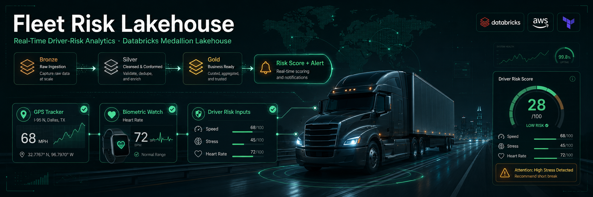

[](https://github.com/theofanis-tsakanikas/databricks-fleet-dabs-orchestration/actions/workflows/deploy-fleet-pipeline.yml)
[](./LICENSE)
[](https://www.databricks.com/)
[](https://aws.amazon.com/)
[](https://www.terraform.io/)
[](https://spark.apache.org/)
[](https://www.python.org/)

> An end-to-end, Infrastructure-as-Code data lakehouse that correlates real-time vehicle telemetry with driver biometrics to score fleet safety risk in near real time.

## 📑 Table of Contents

- [Strategic Overview](#-strategic-overview)
- [What This Project Demonstrates](#-what-this-project-demonstrates)
- [System Architecture & Technical Stack](#-system-architecture--technical-stack)
- [Project Blueprint](#-project-blueprint)
- [The Medallion Journey (Data Engineering Deep-Dive)](#-the-medallion-journey-data-engineering-deep-dive)
- [Executive Observability](#-executive-observability)
- [DevOps & Infrastructure as Code](#-devops--infrastructure-as-code)
- [Operational Guide (Local Deployment & Lifecycle)](#-operational-guide-local-deployment--lifecycle)
- [Future Roadmap & Scalability](#-future-roadmap--scalability)
- [Conclusion](#-conclusion)

> 📘 For an engineering-focused reference (environment variables, layer apply order, gotchas), see [CLAUDE.md](./CLAUDE.md). For design rationale, see the [Architecture Decision Records](./docs/adr/).

## 🎯 Strategic Overview
This project delivers a production-ready **Data Lakehouse** engineered for the high-stakes logistics industry. By correlating **Real-Time Vehicle Telemetry** (GPS, Speed) with **Driver Biometrics** (Heart Rate, Stress), the platform transitions from reactive monitoring to **proactive risk prevention**.

The entire ecosystem is governed by **Infrastructure as Code (IaC)**, ensuring that every cloud resource, security policy, and data pipeline is version-controlled, repeatable, and audit-ready.

---

## ✅ What This Project Demonstrates

This repository is a portfolio piece showcasing production-grade data and platform engineering practices end to end:

* **Layered Infrastructure as Code** — three isolated Terraform layers (foundation, workspace, governance) with per-layer remote state and automated secret injection. See [ADR-001](./docs/adr/ADR-001-terraform-layered-state.md).
* **Medallion data architecture** — Bronze (Auto Loader ingestion) → Silver (cleansing, deduplication) → Gold (temporal join, risk scoring) on Apache Spark Structured Streaming.
* **Asynchronous stream correlation** — a 60-second temporal join window to align independent telemetry and biometric streams. See [ADR-002](./docs/adr/ADR-002-temporal-join-window.md).
* **Business-ready analytics** — a derived `risk_score` and inline data-quality assertions guarding every Gold table.
* **CI/CD automation** — GitHub Actions for full `apply` on merge and sticky Terraform `plan` comments on pull requests.
* **Governance & observability** — Unity Catalog fine-grained access control and Grafana dashboards backed by a serverless SQL Warehouse. See [ADR-003](./docs/adr/ADR-003-sql-warehouse-grafana.md).

---

## 🏗️ System Architecture & Technical Stack
The platform implements a robust **Medallion Architecture**, providing full data lineage and automated quality enforcement at scale.

* **Cloud Infrastructure:** AWS (S3, Secrets Manager, IAM, VPC).
* **Storage Strategy:** Isolated triple-bucket architecture (Data, Metadata, Terraform State).
* **Governance:** Databricks Unity Catalog (UC) for fine-grained access control.
* **Orchestration:** Databricks Asset Bundles (DABs) & Workflow DAGs.
* **Engine:** Apache Spark (Structured Streaming) & Python.
* **CI/CD & Automation:** GitHub Actions, Terraform, Bash.
* **Observability:** Grafana Dashboards via Databricks SQL Warehouse.

**End-to-End Real-Time Fleet Monitoring & Safety Analytics Architecture**

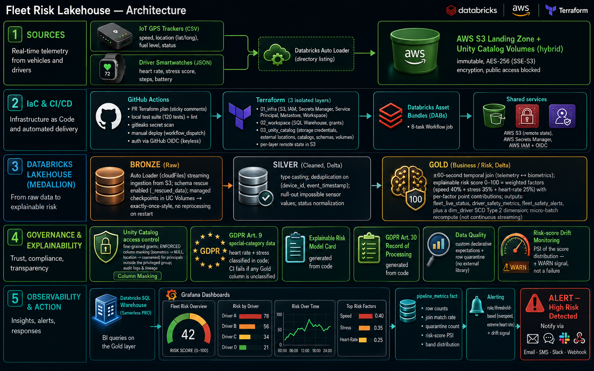

---

## 📂 Project Blueprint
```text
portfolio/
├── .github/workflows/
│   └── deploy-fleet-pipeline.yml    # Multi-stage CI/CD Orchestration
└── projects/
    └── databricks-fleet-dabs-orchestration/
        ├── terraform/
        │   ├── 01_infra/           # Foundation: S3, IAM, Service Principals
        │   ├── 02_workspace/       # Databricks Workspace & Secrets Config
        │   ├── 03_unity_catalog/   # Governance: Catalogs, Schemas, Grants
        │   └── modules/            # Reusable Infrastructure Modules
        ├── notebooks/
        │   ├── bronze/             # Ingestion: Auto Loader logic
        │   ├── silver/             # Quality: Cleaning & Deduplication
        │   └── gold/               # Value: Temporal Joins & Risk Logic
        ├── src/
        │   └── mock_generator/     # IoT Simulation Engine
        │       ├── fleet_config.json
        │       ├── producer_trackers.py
        │       └── producer_watches.py
        ├── databricks.yml          # DABs Deployment Definition
        ├── terraform.sh            # Custom IaC Layer Orchestrator
        ├── bundle.sh               # Asset Bundle & SPN Bridge
        ├── setup.sh                # Local Env Bootstrapper
        └── requirements.txt        # Python Dependencies
```
---

## 💎 The Medallion Journey (Data Engineering Deep-Dive)

**Visualizing the End-to-End Orchestration of the Data Pipeline**

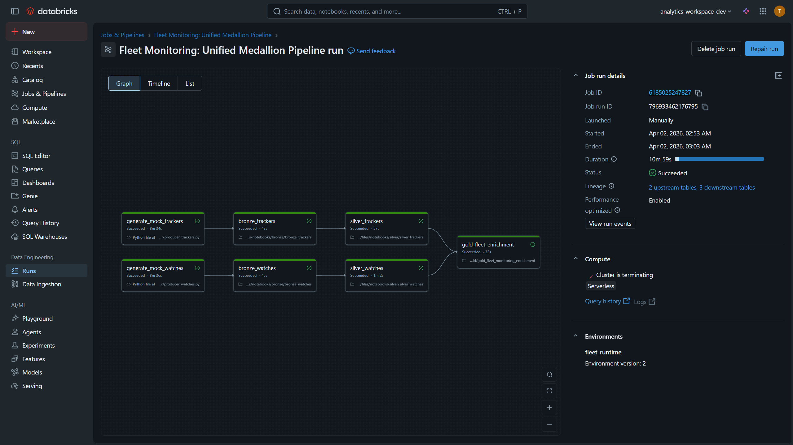

> **Workflow Orchestration:** This DAG illustrates the unified execution lifecycle.
> * **Parallel Multi-Track Processing:** The pipeline utilizes independent parallel tracks for different data domains (Trackers & Wearables). Ingestion (Bronze) and Transformation (Silver) tasks run concurrently, significantly reducing total processing time before converging at the Gold enrichment stage.
> * **Operational Reliability:** Tasks are fully decoupled, supporting independent retries and precise state monitoring.

**0. Data Generation & IoT Simulation (The Source)**
* **Engine:** Python-based Producers with **Error Injection** logic.
* **Landing Zone:** AWS S3 Landing Zone & Unity Catalog Volumes.

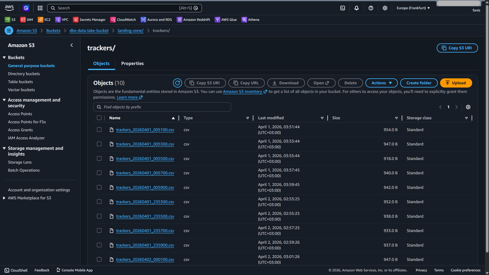

> **Simulation Logic:** To validate pipeline resilience, our producers inject intentional "sensor noise" (null heart rates, negative speeds, and duplicates). The system supports a **Hybrid Landing Strategy**, allowing files to be pushed to S3 or directly into UC Volumes for serverless processing.

**1. Bronze Layer (Automated Ingestion)**
* **Tool:** Databricks Auto Loader (`cloudFiles`).
* **Resilience:** Schema evolution and **Rescued Data** column mapping.
* **Fault Tolerance:** Managed Checkpointing via Unity Catalog Volumes.

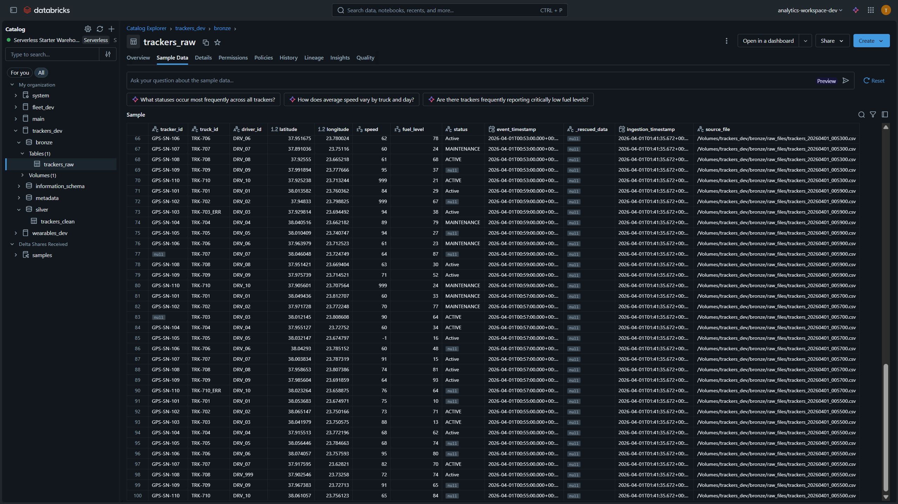

**Stateful Streaming & Checkpoint Orchestration**

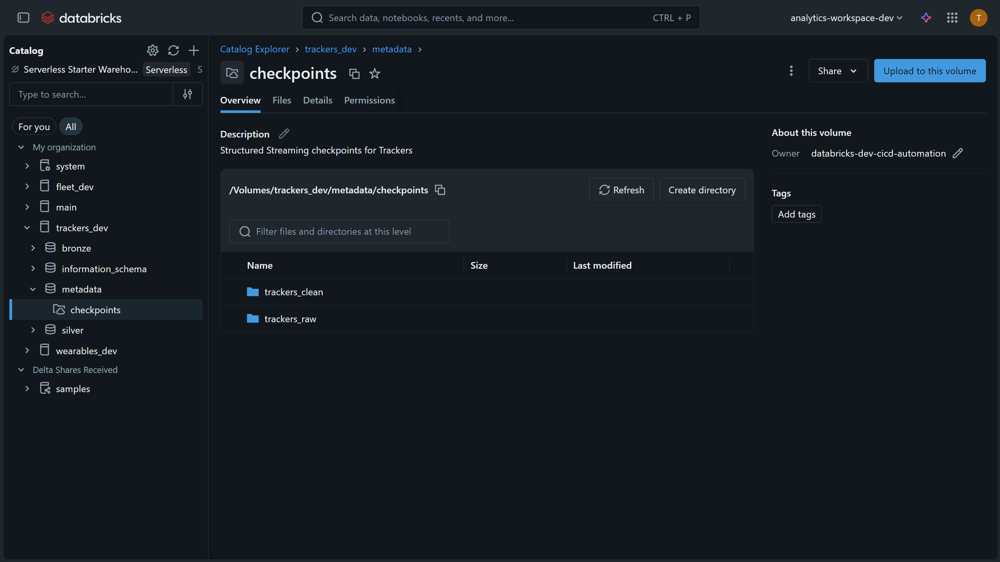

> **Reliability Engineering:** As shown in the Unity Catalog Volume above, the platform implements a **Strict Checkpointing Policy**. By utilizing Managed Volumes for streaming offsets, we ensure that pipelines can recover from failures instantly without data duplication. This technical metadata layer is isolated from the data layers to maintain a clean security boundary while providing the "State" required for exactly-once processing.

> **The Rescue Pattern:** Using `schemaEvolutionMode: rescue`, malformed IoT records are never lost. They are diverted to a hidden column for post-mortem analysis, ensuring zero data loss during high-velocity ingestion.

**2. Silver Layer (Quality Enforcement & Sanitization)**
* **Logic:** Type Casting, Deduplication, and **Standardization**.
* **Quality Gates:** Filtering impossible sensor values (e.g., Speed > 200 km/h).

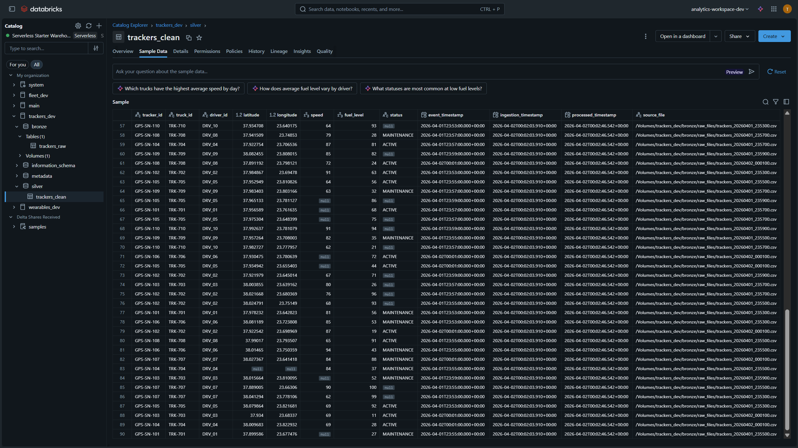

> **Sanitization Impact:** This layer prunes "Ghost Drivers" and corrupted IDs. We enforce **String Normalization** (Trim/Upper) on status codes, creating a reliable foundation for downstream BI.

**3. Gold Layer (Business Intelligence & Risk Analytics)**
* **Technical Challenge:** Solving Asynchronous Stream Correlation via **60s Temporal Joins**.
* **Business Value:** Dynamic Risk Scoring and Safety Auditing.

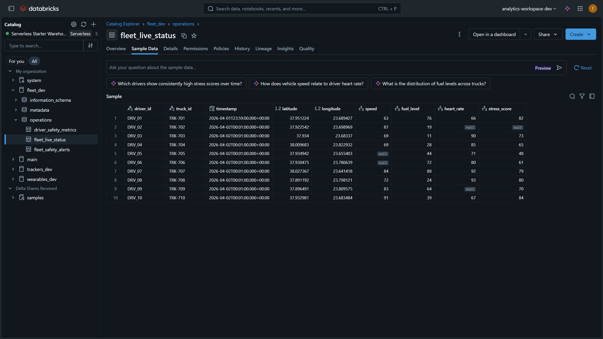 

> **Live Fleet Status:** The final refined state. By joining Tracker telemetry with Biometric streams, the system calculates a **Risk Level** on-the-fly, providing a single source of truth for operational safety.

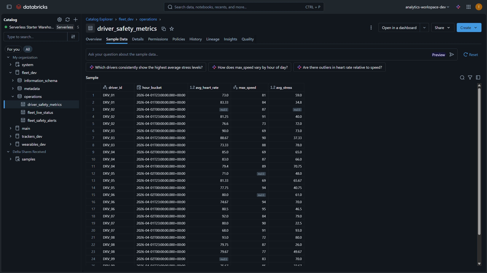 

> **Safety Metrics & Alerts:** Beyond real-time views, the Gold layer aggregates hourly behavior and triggers **Critical Alerts** (e.g., High Speed + High Stress) through complex event processing.

---

## 📈 Executive Observability
**Real-Time Fleet Health and Risk Monitoring Dashboard**

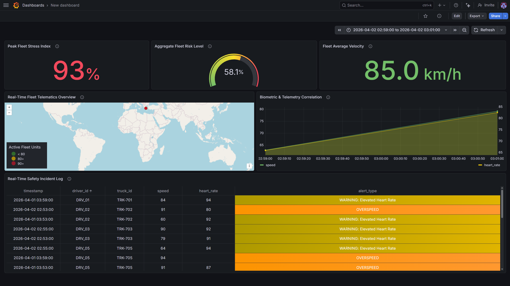

> **Data-Driven Decision Making:** This Grafana dashboard transforms raw signals into a "Pane of Glass" for fleet managers. It reduces incident response time by identifying dangerous correlations—like physical driver stress during high-speed maneuvers—instantly.

---

## ⚙️ DevOps & Infrastructure as Code

**1. 🚀 CI/CD Automation Pipeline**
The project utilizes a sophisticated GitHub Actions workflow to bridge the gap between Terraform and Databricks Asset Bundles.

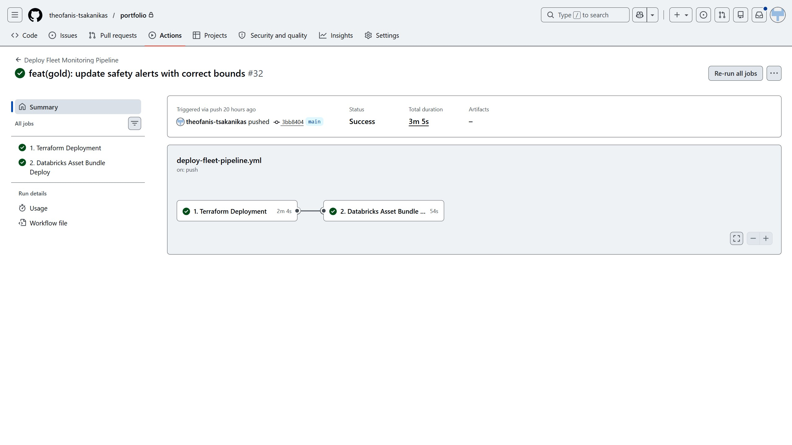

> **Pipeline Intelligence:** The workflow captures dynamic Terraform outputs (like Service Principal IDs) and injects them into the deployment context, ensuring a "zero-touch" promotion from Dev to Production.

**2. 🛠️ The `terraform.sh` Orchestrator**
To manage multi-layer complexity, a custom utility script was developed to:
* **Automate Secret Injection:** Fetches credentials from **AWS Secrets Manager** and maps them to `TF_VAR_` variables.
* **Manage State Locks:** Ensures backend consistency across 01_infra, 02_workspace, and 03_unity_catalog layers.
* **Professional Lifecycle:** Integrated support for linting, planning, and auto-approved applications in CI/CD environments.

**3. ☁️ Modular Remote State Storage (AWS S3)**

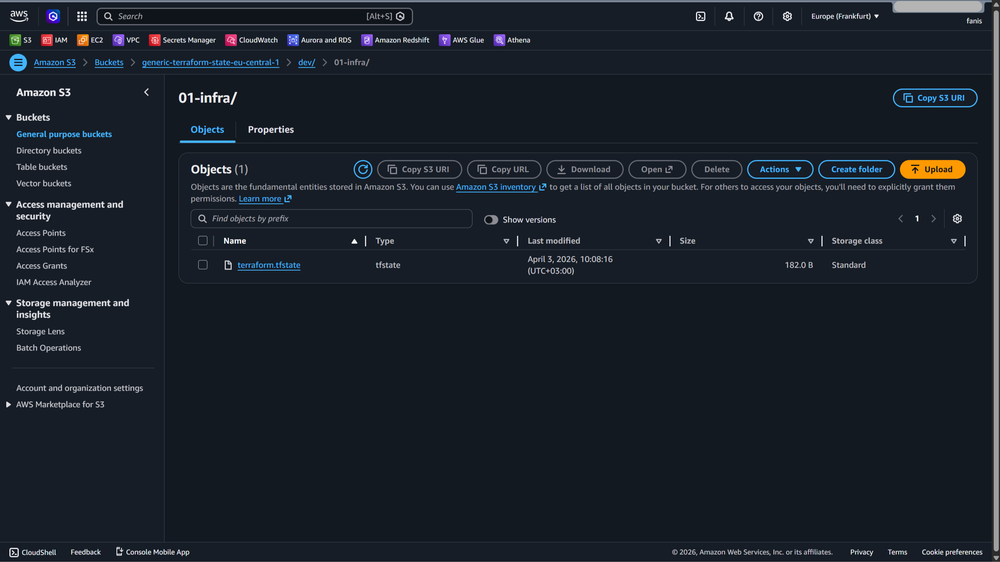

> **Enterprise-Grade Consistency:** As illustrated in the S3 bucket structure above, the project utilizes a **Modular State Strategy**. By isolating the state files (`terraform.tfstate`) for `01-infra`, `02-workspace`, and `03-unity_catalog`, we minimize the "blast radius" of infrastructure changes. This decoupled architecture ensures that foundation-level resources remain protected during application-level updates and provides a robust single source of truth for the CI/CD pipeline.

---

## 🚦 Operational Guide (Local Deployment & Lifecycle)

**1. Environment Setup & Bootstrapping**
Initialize the local developer environment, install dependencies, and prepare environment variables:
```bash
chmod +x setup.sh terraform.sh bundle.sh
./setup.sh
```

**2. Multi-Layer Infrastructure Deployment**
The platform is deployed in logical layers to ensure dependency integrity. The `terraform.sh` utility handles automated secret injection from AWS Secrets Manager and state management for each layer:
```bash
# Layer 01: AWS Foundation (S3, IAM, Service Principals)
./terraform.sh 01_infra apply  

# Layer 02: Databricks Workspace (Clusters, Jobs, Secrets)
./terraform.sh 02_workspace apply 

# Layer 03: Unity Catalog (Governance & Data Access)
./terraform.sh 03_unity_catalog apply
```

**3. Pipeline Orchestration**
Deploy the Spark logic via Databricks Asset Bundles (DABs) and trigger the end-to-end Medallion Job:
```bash
# Deploy Databricks Asset Bundle
./bundle.sh deploy             

# Trigger execution immediately
./bundle.sh run
```

**4. Automated Resource Teardown (Cloud Hygiene & Cost Optimization)**
To maintain strict cloud hygiene and prevent unnecessary billing, the platform supports a **full-lifecycle teardown**. This ensures that all ephemeral resources, storage credentials, and compute clusters are decommissioned in the precise reverse-dependency order:
```bash
# Decommissioning the infrastructure layers
./terraform.sh 03_unity_catalog destroy
./terraform.sh 02_workspace destroy
./terraform.sh 01_infra destroy
```
**Verified Terraform State-Aware Infrastructure Decommissioning**

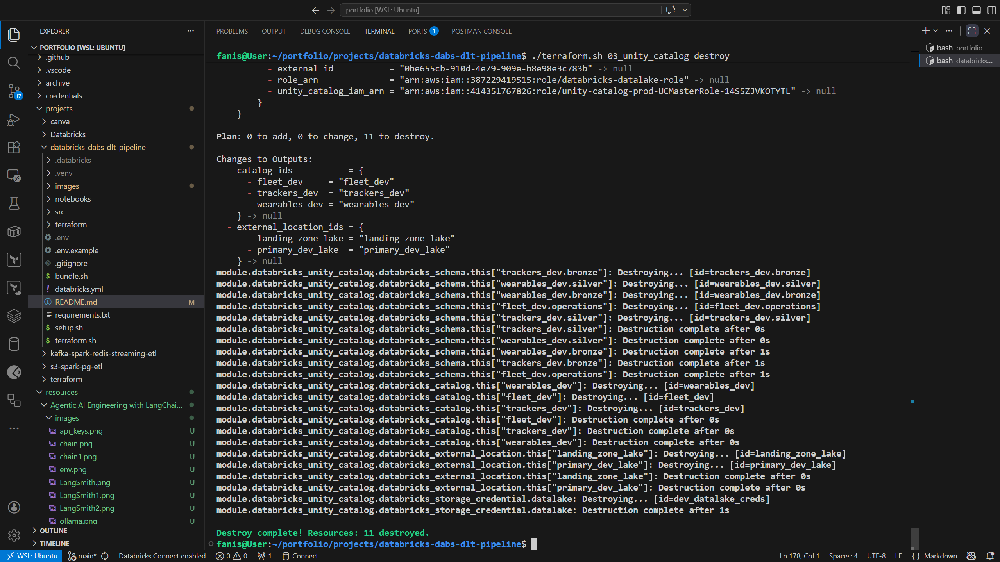

> **Governance Lifecycle Verification:** The log above validates the successful decommissioning of the **Unity Catalog layer**. By executing this "State-Aware" teardown, we ensure that all governance assets—including Catalogs, Schemas, and External Location grants—are securely purged. This prevents "security drift" and ensures that no stale access policies or orphaned metadata remain in the Databricks Metastore, maintaining a clean and audit-ready environment.

## 🚀 Future Roadmap & Scalability
Τhe platform is designed for continuous evolution:
* **Predictive Safety:** Implementing **Databricks Model Serving** to predict driver fatigue using biometric aggregates.
* **Delta Live Tables (DLT):** Transitioning to DLT for automated scaling and advanced data quality "Expectations".
* **Enhanced Security:** Moving to a fully private networking model via **AWS VPC PrivateLink**.

## 🤝 Conclusion
This project demonstrates a **Modern Data Stack** built on the core principles of **Reliability, Security, and Observability**. By treating Infrastructure as Code and Data as a Product, we have created a system that doesn't just process logs—it provides the insights necessary to save lives in the logistics sector.

---


