# 🚛 Fleet Risk Lakehouse — Real-Time Driver-Risk Analytics on Databricks & AWS
**An enterprise-grade data platform, orchestrated by Terraform & GitHub Actions — explainable by design and GDPR-governed.**

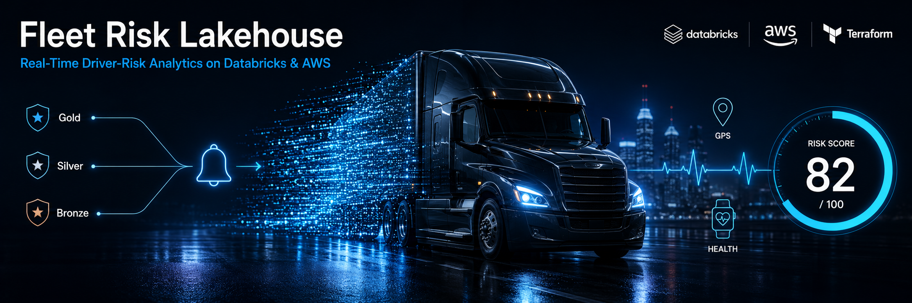

[](https://github.com/theofanis-tsakanikas/fleet-risk-lakehouse/actions/workflows/deploy-fleet-pipeline.yml)
[](https://github.com/theofanis-tsakanikas/fleet-risk-lakehouse/actions/workflows/ci.yml)
[](./LICENSE)
[](https://www.databricks.com/)
[](https://aws.amazon.com/)
[](https://www.terraform.io/)
[](https://spark.apache.org/)
[](https://www.python.org/)

> An end-to-end, Infrastructure-as-Code data lakehouse that **correlates vehicle telemetry with driver biometrics** to score fleet-safety risk in near real time — then **explains** the score, **governs** the sensitive data (GDPR Art. 9), and **pages** the on-call team when it turns critical.

A driver can pass every single check — legal speed, "normal" heart rate — and still be one moment from an incident. Speed alone doesn't tell the story; biometrics alone don't either. **Together, they do.** This platform joins the two signals, produces a single explainable risk score, and escalates the critical cases.

## 📑 Table of Contents

- [Strategic Overview](#-strategic-overview)
- [What This Project Demonstrates](#-what-this-project-demonstrates)
- [System Architecture & Technical Stack](#️-system-architecture--technical-stack)
- [Project Blueprint](#-project-blueprint)
- [The Medallion Journey (Data Engineering Deep-Dive)](#-the-medallion-journey-data-engineering-deep-dive)
- [Quality, Governance & Observability](#-quality-governance--observability)
- [Dashboards & Alerting](#-dashboards--alerting)
- [DevOps & Infrastructure as Code](#️-devops--infrastructure-as-code)
- [Operational Guide (Local Deployment & Lifecycle)](#-operational-guide-local-deployment--lifecycle)
- [Future Roadmap & Scalability](#-future-roadmap--scalability)
- [Conclusion](#-conclusion)

> 📘 For an engineering-focused reference (environment variables, layer apply order, gotchas), see [CLAUDE.md](./CLAUDE.md). For design rationale, see the [Architecture Decision Records](./docs/adr/) (ADR-001…010); for ops, [docs/RUNBOOK.md](./docs/RUNBOOK.md); for scale, [docs/SCALING.md](./docs/SCALING.md); for the system shape, [docs/architecture.md](./docs/architecture.md).

## 🎯 Strategic Overview

This project delivers a production-ready **data lakehouse** for the high-stakes logistics industry. By correlating **vehicle telemetry** (GPS, speed, fuel) with **driver biometrics** (heart rate, stress), it moves from reactive monitoring to **proactive risk prevention** — producing a per-driver risk score, recomputed each micro-batch run, and pushing critical alerts to Slack + PagerDuty.

The entire ecosystem is governed by **Infrastructure as Code** — every cloud resource, security policy, dashboard, and data pipeline is version-controlled, repeatable, and audit-ready. Two `terraform apply`s and one click in GitHub reproduce the whole thing.

> ℹ️ **Reference implementation, not a production deployment.** Scope and trade-offs (e.g. micro-batch over continuous streaming) are deliberate and documented in the [ADRs](./docs/adr/).

---

## ✅ What This Project Demonstrates

Production-grade data and platform engineering, end to end:

* **Layered Infrastructure as Code** — five isolated Terraform layers (foundation, workspace, Unity Catalog governance, + two standalone Grafana layers) with per-layer remote state and automated secret injection. See [ADR-001](./docs/adr/ADR-001-terraform-layered-state.md).
* **Medallion data architecture** — Bronze (Auto Loader ingestion) → Silver (cleansing, dedup) → Gold (temporal join, risk scoring) on Apache Spark **Structured Streaming**; the Gold layer is a batch micro-batch recompute. See [ADR-004](./docs/adr/ADR-004-micro-batch-execution.md).
* **Asynchronous stream correlation** — a ±60-second temporal join to align independent telemetry and biometric streams. See [ADR-002](./docs/adr/ADR-002-temporal-join-window.md).
* **Real-world data, replayed** — a second job streams **real vehicle telemetry** (the [Vehicle Energy Dataset](data/ved/README.md): genuine GPS traces, speeds, hard-braking events) through the exact same medallion contract, with biometrics simulated *conditioned on the real driving events*. See [ADR-008](./docs/adr/ADR-008-real-data-replay.md).
* **Explainable-by-design risk scoring** — the risk index is a single source of truth in code (`src/fleet_transforms/risk_model.py`); the Gold view emits each factor's point contribution (`risk_speed_pts` / `risk_stress_pts` / `risk_heart_rate_pts`) and `risk_primary_factor`, so a high-risk driver is *explained*, not just flagged — see the generated [risk model card](docs/governance/RISK_MODEL_CARD.md).
* **Declarative data quality with quarantine** — named SQL expectations (`ERROR`/`WARN`) guard the Gold tables; rows that violate an `ERROR` expectation are *quarantined* (annotated with `_dq_failures`), not silently dropped. See [ADR-005](./docs/adr/ADR-005-declarative-data-quality.md).
* **Biometric governance (GDPR), enforced** — heart rate and stress are classified as **special-category data (Art. 9)** in code; a CI test fails if any Gold column is left unclassified, and **Unity Catalog column masks** NULL the biometrics / coarsen the location for principals outside the privileged group — on **every** Gold surface. A GDPR Art. 30 record + data dictionary are generated from the code. See [ADR-007](./docs/adr/ADR-007-column-masking.md).
* **Dimensional history (SCD Type 2)** — a `dim_driver` slowly-changing dimension versions each driver→truck assignment over time (Delta `MERGE`). See [ADR-006](./docs/adr/ADR-006-scd2-driver-dimension.md).
* **Pipeline self-observability & drift** — an append-only `pipeline_metrics` fact (row counts, join match rate, quarantine count, risk-score PSI, band distribution) + risk-score distribution **drift** detection (a WARN signal).
* **Push alerting (Slack + PagerDuty)** — CRITICAL/DANGER alerts are pushed **from the pipeline** (not by Grafana polling), severity-routed and deduplicated. Only operational/derived fields are sent — **special-category biometrics never leave the platform**. See [ADR-009](./docs/adr/ADR-009-alert-notifications.md).
* **Dashboards as code** — Amazon Managed Grafana, its datasource + dashboards provisioned **100% in Terraform** over the free OSS Infinity datasource (no Enterprise plugin), plus a Streamlit "Fleet Safety Command Center". See [ADR-010](./docs/adr/ADR-010-grafana-infinity-datasource.md).
* **CI/CD automation** — sticky Terraform `plan` comments on PRs; a manual (`workflow_dispatch`) full-`apply` deploy; keyless AWS auth via GitHub **OIDC**; gitleaks secret scanning; and a local test suite (**165 tests**) gating every push.
* **One discoverable interface** — a [`Makefile`](./Makefile) front door (`make help`) wraps the shell scripts and bundles the exact CI gates (`make check`).

---

## 🏗️ System Architecture & Technical Stack

Two source domains (GPS + biometrics) stay isolated in their own catalogs and meet only in the **Gold** catalog — every layer is built on **Spark job compute**; a serverless **SQL Warehouse** only *serves* the result to the dashboards:

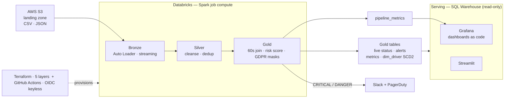
```mermaid
flowchart LR
    S3["AWS S3<br/>landing zone<br/>CSV · JSON"]
    subgraph DBX["Databricks — Spark job compute"]
        direction TB
        BR["Bronze<br/>Auto Loader · streaming"]
        SI["Silver<br/>cleanse · dedup"]
        GO["Gold<br/>60s join · risk score · GDPR masks"]
        BR --> SI --> GO
    end
    GO --> TB["Gold tables<br/>live status · alerts<br/>metrics · dim_driver SCD2"]
    GO --> PM["pipeline_metrics"]
    subgraph SRV["Serving — SQL Warehouse (read-only)"]
        GR["Grafana<br/>dashboards as code"]
        ST["Streamlit"]
    end
    S3 --> BR
    TB --> SRV
    PM --> GR
    GO -->|CRITICAL / DANGER| AL["Slack + PagerDuty"]
    IAC["Terraform · 5 layers  +  GitHub Actions · OIDC keyless"] -. provisions .-> DBX
```

The same flow, captured as **real column-level lineage** by Unity Catalog:

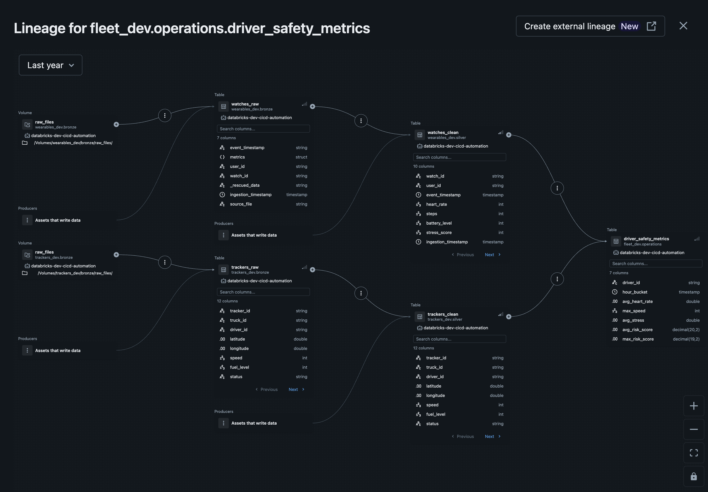

* **Cloud Infrastructure:** AWS (S3, Secrets Manager, IAM, Amazon Managed Grafana).
* **Storage Strategy:** isolated triple-bucket architecture (data lake, metastore, Terraform state).
* **Governance:** Databricks Unity Catalog — fine-grained access control **and enforced column masks** on special-category data.
* **Orchestration:** Databricks Asset Bundles (DABs) — two 8-task Workflow DAGs (mock data on demand; real-data replay on a periodic trigger).
* **Engine:** Apache Spark (Structured Streaming) & Python; pure, unit-tested transform logic under `src/`.
* **CI/CD & Automation:** GitHub Actions (keyless OIDC), Terraform, Bash, a `Makefile` front door.
* **Dashboards:** Amazon Managed Grafana (datasource + dashboards **as code**) and a Streamlit command center, both over a serverless Databricks SQL Warehouse.
* **Alerting:** pipeline-triggered push to Slack + PagerDuty — severity-routed, deduplicated, biometric-safe.

The three domain catalogs and the enforced masking **functions** (`mask_biometric`, `mask_location`) live in Unity Catalog:

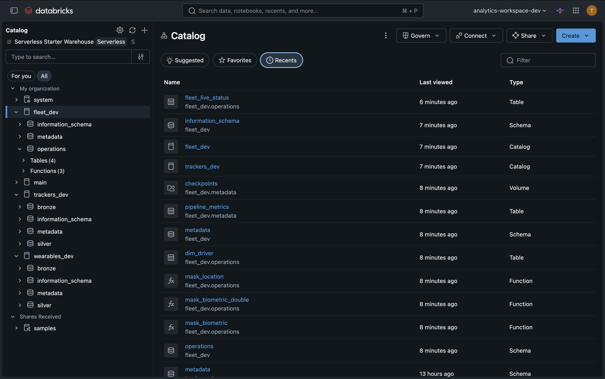

---

## 📂 Project Blueprint
```text
fleet-risk-lakehouse/
├── .github/workflows/         # CI (tests/lint), PR Terraform plan, manual deploy, run-scenario, destroy, gitleaks
├── notebooks/
│   ├── bronze/                # Ingestion: Auto Loader (cloudFiles) → Delta
│   ├── silver/                # Quality: cleansing, dedup, sentinel handling
│   └── gold/
│       ├── gold_fleet_monitoring_enrichment.py  # Join + risk + DQ/quarantine + masking + drift + metrics + alerting
│       └── gold_dim_driver.py                    # SCD Type 2 driver→truck dimension
├── src/
│   ├── fleet_transforms/      # silver, gold (SQL builders + DQ suite), risk_model,
│   │                          # quality (expectations), observability, dimensions (SCD2), drift (PSI)
│   ├── fleet_governance/      # classification (GDPR Art. 9), masking (UC column masks), generate (docs)
│   ├── mock_generator/        # IoT simulation engine (dirty-data + genuine extreme-HR incidents)
│   ├── replay/                # Real-data replay: VED parsing, event-conditioned biometrics, producer
│   └── fleet_alerting/        # Push safety alerts to Slack + PagerDuty from the pipeline (ADR-009)
├── app/                       # Streamlit "Fleet Safety Command Center" (offline demo or live Databricks SQL)
├── data/ved/                  # Committed real VED sample (10 vehicles, 18 trips) + attribution
├── docs/
│   ├── adr/                   # ADR-001..010 (state, join, BI, micro-batch, DQ, SCD2, masking, replay, alerting, grafana)
│   ├── governance/            # Generated risk model card + GDPR Art. 30 processing record
│   └── architecture.md · RUNBOOK.md · SCALING.md · TESTING.md
├── terraform/                 # 01_infra · 02_workspace · 03_unity_catalog · 04_grafana · 05_grafana_content · modules/
├── tests/                     # 165 tests (pure-Python + local PySpark)
├── databricks.yml             # DABs bundle: 2 jobs (mock + real-data replay), variables, targets
├── Makefile                   # Front door: `make help`
└── terraform.sh / bundle.sh / setup.sh   # Layer orchestrator / DABs bridge / local bootstrap
```
---

## 💎 The Medallion Journey (Data Engineering Deep-Dive)

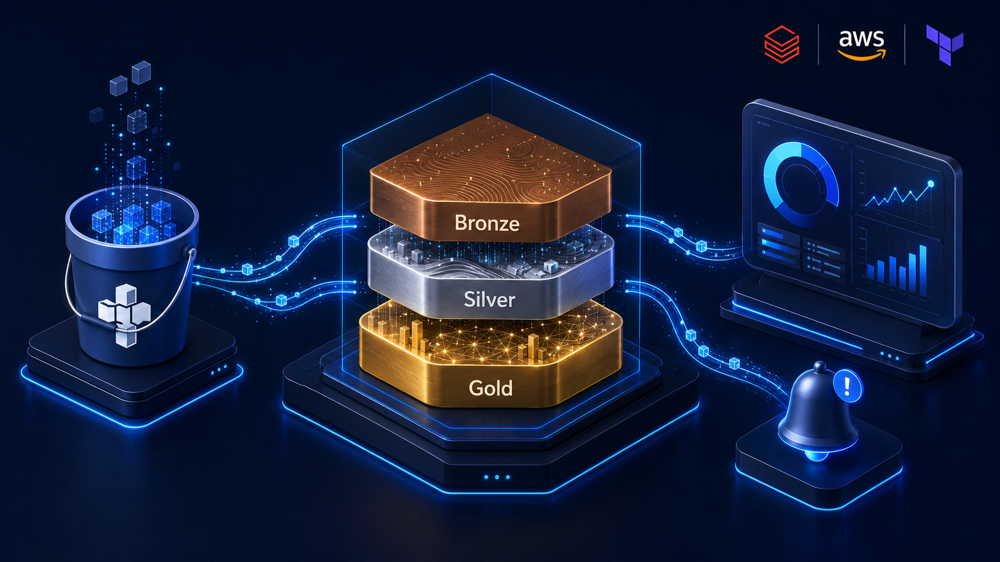

**The 8-task Workflow DAG** — independent parallel tracks per data domain (Trackers & Wearables). Bronze and Silver run concurrently, converging at Gold enrichment; the SCD2 `build_dim_driver` task runs in parallel with Gold:

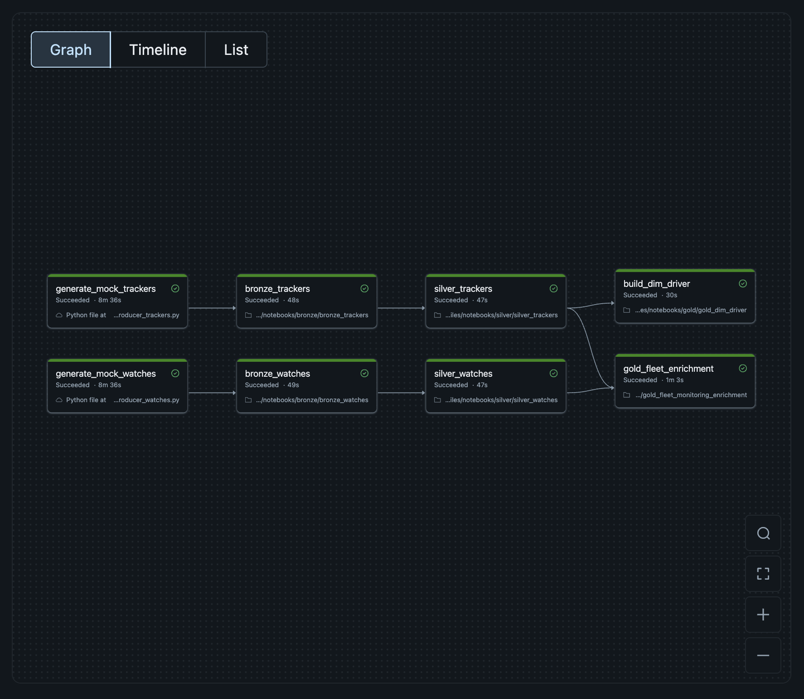

### 0. Data Sources — simulation *and* the real world
* **Mock engine:** Python producers with **intentional error injection** (null heart rates, sentinel speeds, malformed IDs, ~20% duplicates) *plus* genuine extreme-heart-rate safety incidents — so the DANGER / CRITICAL alert paths actually fire on realistic data.
* **Real-data replay:** `real_telemetry_job` streams genuine VED trips through the identical contract; biometrics are simulated *conditioned on those real events* ([ADR-008](./docs/adr/ADR-008-real-data-replay.md)).

The raw CSV / JSON batches land in an **S3 landing zone** (an external Unity Catalog volume), where Auto Loader picks them up:

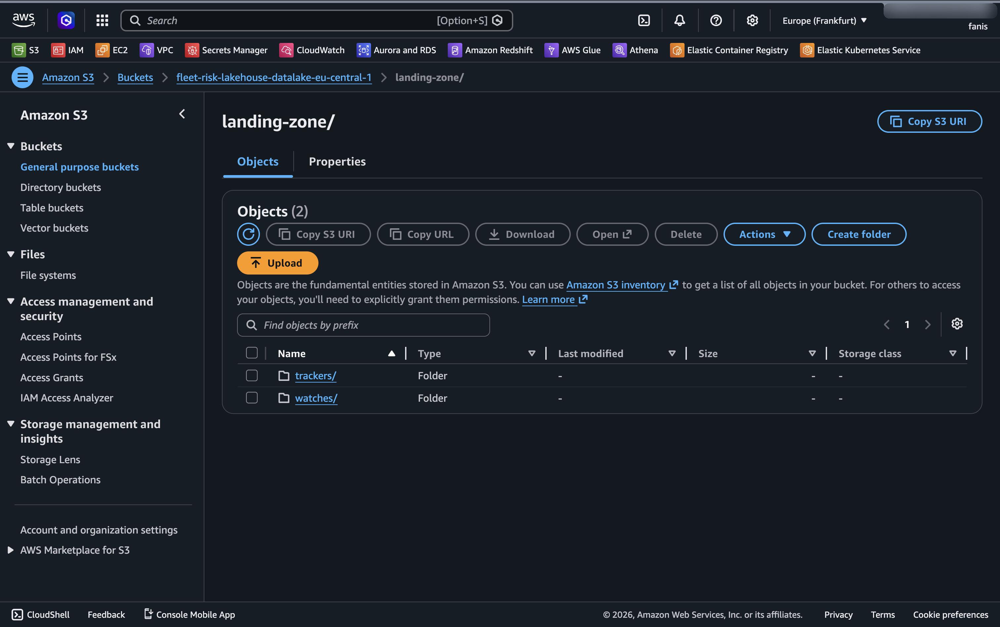

### 1. Bronze — automated ingestion
Databricks **Auto Loader** (`cloudFiles`, Structured Streaming) with schema evolution + a **rescued-data** column (`_rescued_data`) so malformed records are never lost, and **managed checkpointing** in an isolated Volume → exactly-once-style, no reprocessing on restart:

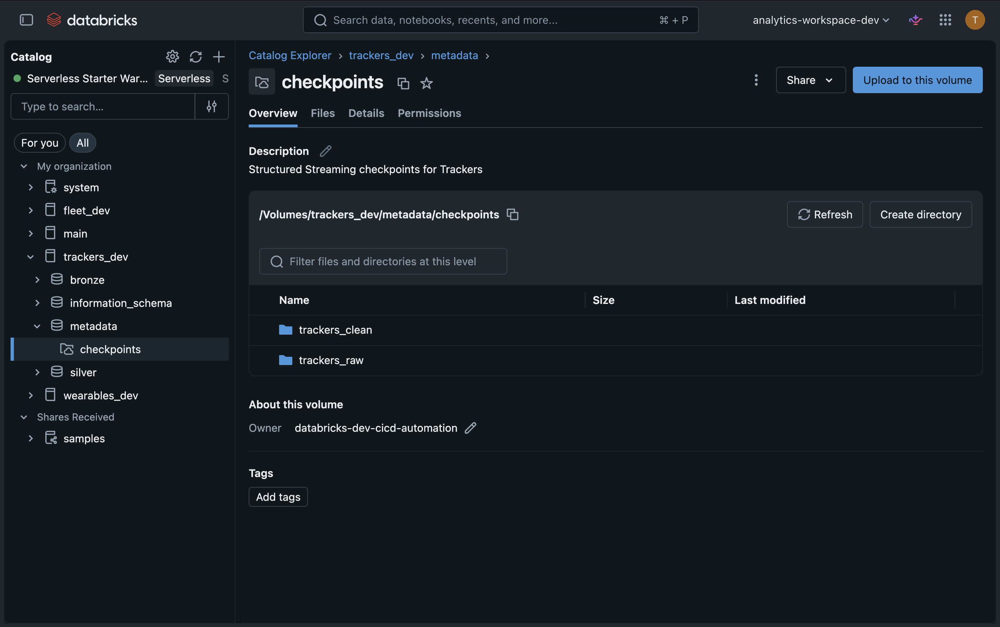

Physically, the managed Delta tables live on S3 — each as a UUID-keyed folder (Unity Catalog decouples the name from the path) with a `_delta_log/` transaction log (ACID + time travel) and ZSTD-compressed Parquet:

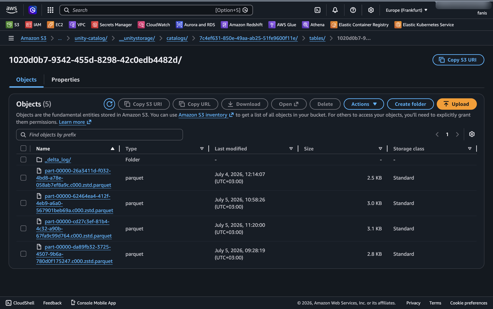

### 2. Silver — quality enforcement
Type casting, deduplication on `(device_id, event_timestamp)`, and a **"clean, don't destroy"** philosophy: it drops unrecoverable rows (ghost driver `DRV_999`, malformed IDs) but *nulls* individual bad sensor readings (GPS `(0,0)`, speed `-1`/`999`, heart rate `-999`/`0`/`>220`) while keeping the row — and never fabricates a value. The row-drop is measurable:

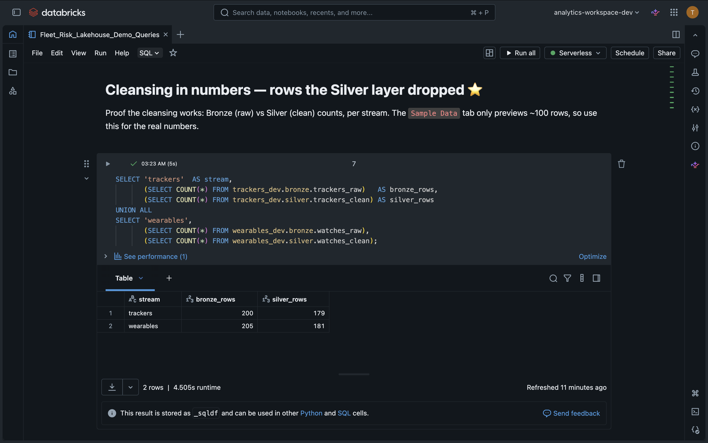

### 3. Gold — correlation, scoring & explainability
Asynchronous stream correlation via a **±60s temporal join**, then the headline: a risk score that **shows its work** — the per-factor point breakdown and the primary driver of risk:

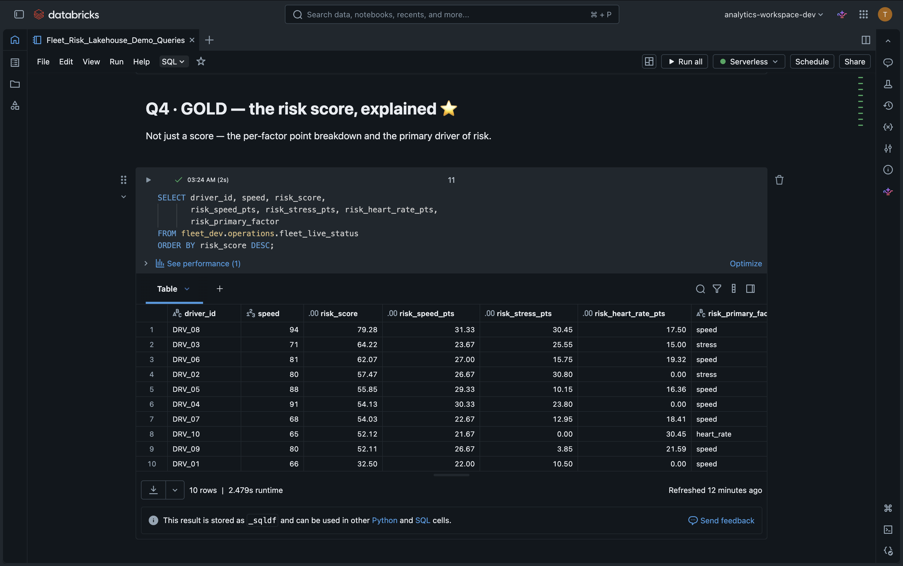

Every qualifying event is classified into an alert type (`CRITICAL` / `DANGER` / `WARNING` / `OVERSPEED`) in `fleet_safety_alerts` — the table that feeds Slack + PagerDuty:

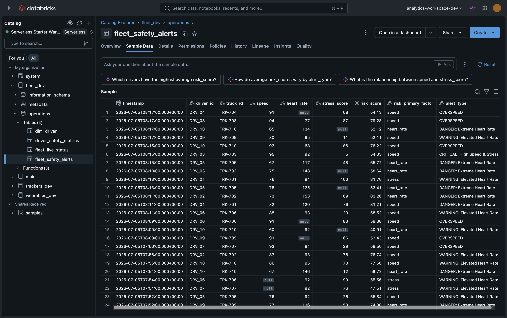

---

## 🔍 Quality, Governance & Observability

Beyond the joins, the Gold stage wraps the enrichment with cross-cutting concerns, each backed by a pure, unit-tested module under `src/` (the notebook only orchestrates): declarative data quality with **quarantine** ([ADR-005](./docs/adr/ADR-005-declarative-data-quality.md)), enforced **column masks** ([ADR-007](./docs/adr/ADR-007-column-masking.md)), risk-score **drift** (PSI), and pipeline **self-metrics**.

### GDPR masking, demonstrated — *same query, two principals*

The mask is a single predicate — `is_account_group_member('fleet_safety_officers')` — so the **same query returns different data depending on who runs it.**

**As a `fleet_safety_officers` member** (privileged), real biometrics + precise location:

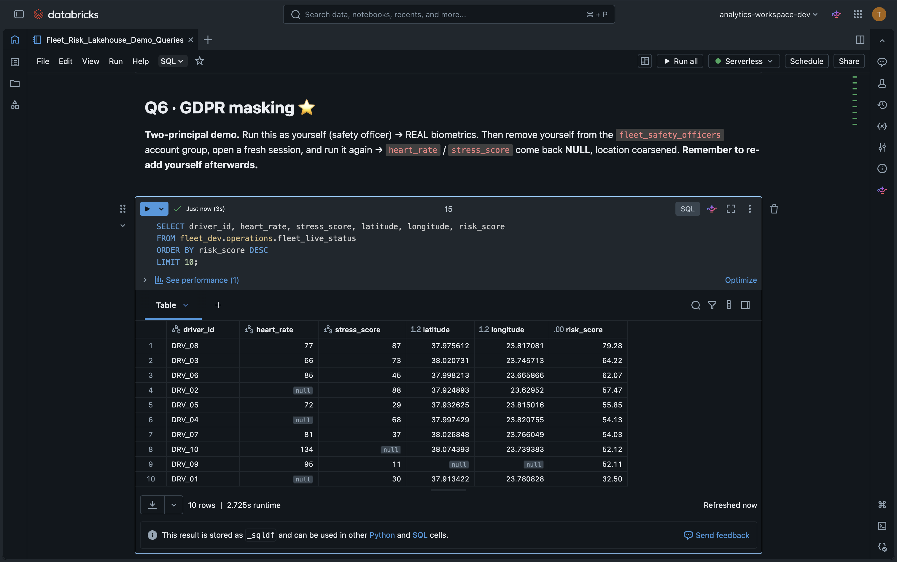

**As an analyst outside the group** (e.g. the read-only BI SPN behind Grafana), the biometrics come back **NULL** and the location is coarsened to one decimal:

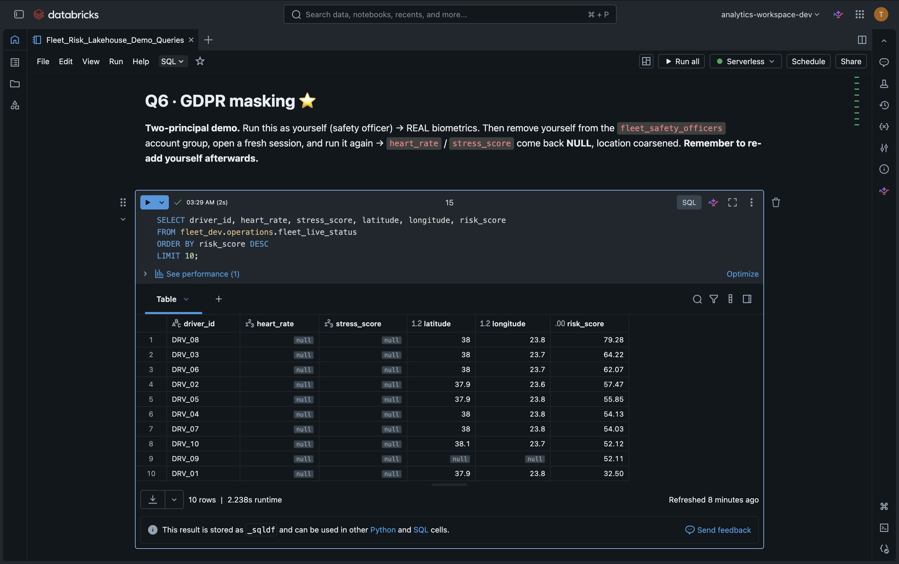

Nothing in the data changes — only the principal does. That is GDPR Art. 9 governance *enforced by the platform*, not just documented.

---

## 📊 Dashboards & Alerting

### Streamlit — the live command center
A self-contained **"Fleet Safety Command Center"** reads the Gold layer directly over the serverless SQL Warehouse — or falls back to a bundled offline demo dataset when no workspace is configured (one toggle in the sidebar, no code change). Connected, the header badge flips to **● LIVE · DATABRICKS SQL**, and the KPIs, a risk-coloured fleet map, and a per-driver leaderboard all update from the real `fleet_dev.operations` Gold tables:

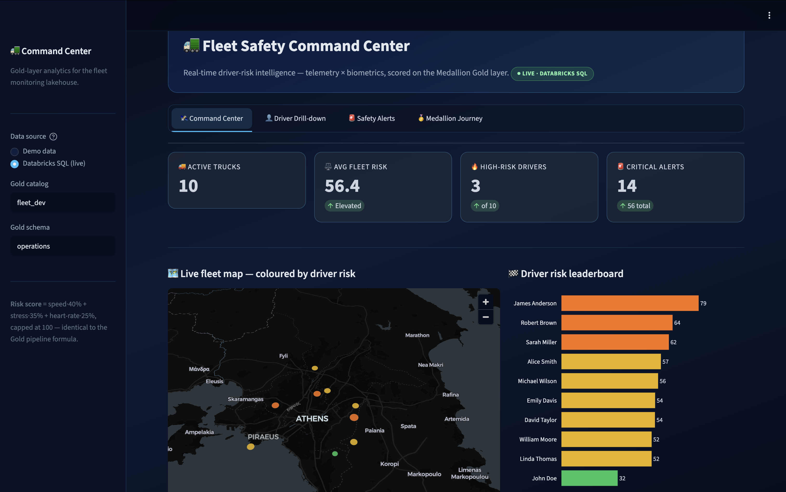

The **Driver Drill-down** makes the core thesis visible — telemetry and biometrics overlaid on a single ±60-second timeline. Speed, heart rate, and the resulting risk score move together; either signal alone would miss the moment the correlation catches:

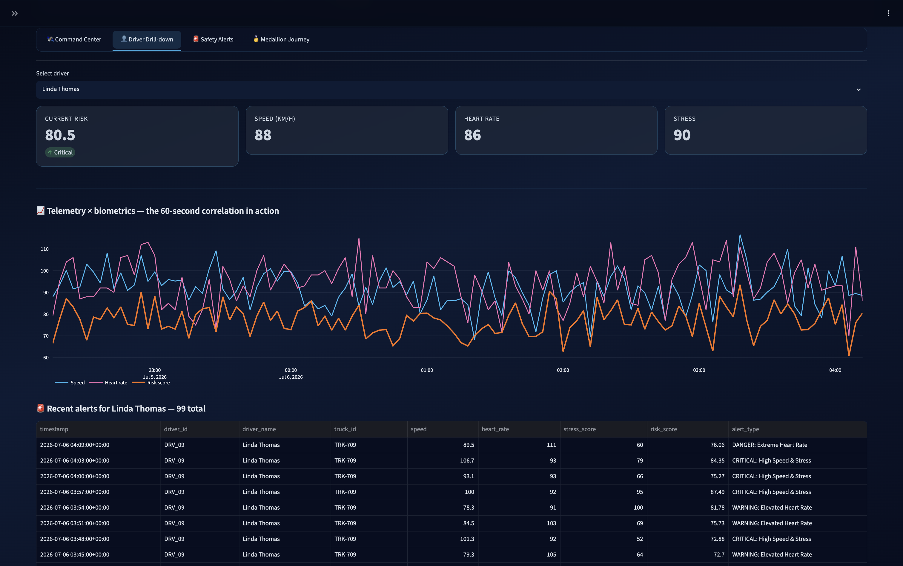

### Grafana — dashboards as code
Amazon Managed Grafana, with its datasource + dashboards provisioned **entirely in Terraform** ([ADR-010](./docs/adr/ADR-010-grafana-infinity-datasource.md)). To avoid the Enterprise Databricks plugin (+$45/user/mo on AMG), it queries through the free OSS **Infinity** datasource → the Databricks SQL Statement Execution API, authenticated with the read-only BI service principal (so it respects the column masks by construction). The **Fleet Operations** dashboard — risk gauges, a geomap of the fleet coloured by risk (coarse, masked location), a per-driver leaderboard, and severity-coloured alert/factor breakdowns:

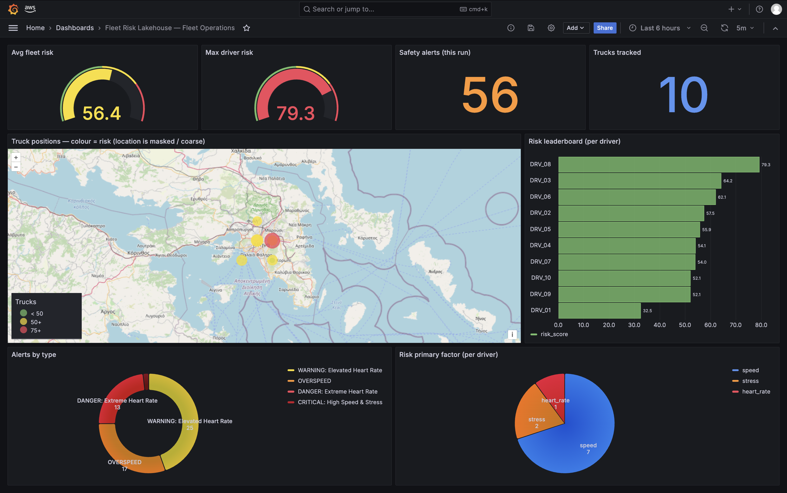

### Push alerting — Slack + PagerDuty
Critical events are pushed **from the Gold run** itself. **Slack** gets a batched, team-awareness message (note: the outgoing payload carries only allowlisted operational fields — **no raw biometrics**):

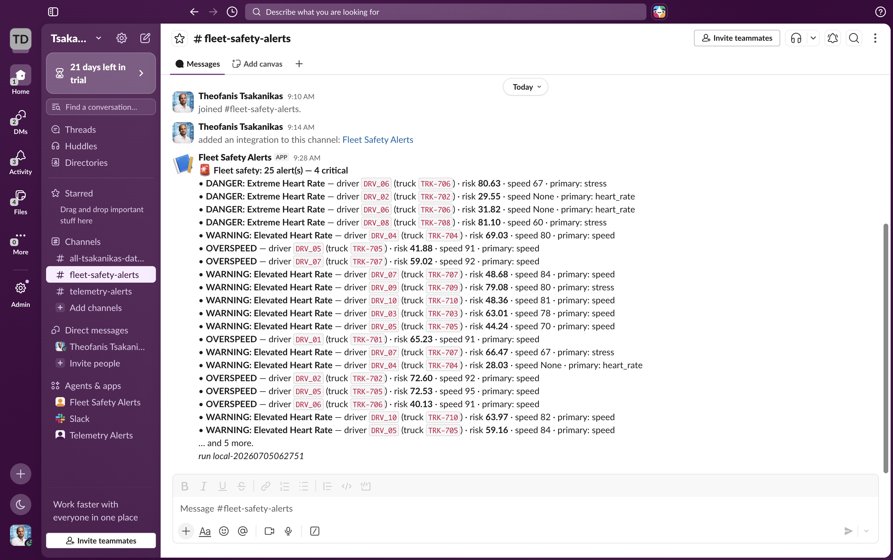

**PagerDuty** gets the on-call escalation for `CRITICAL` / `DANGER`, deduplicated per driver+severity — the custom details carry the alert type, driver, risk score and speed, but never the raw heart rate:

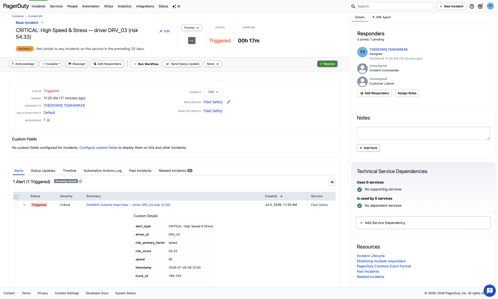

---

## ⚙️ DevOps & Infrastructure as Code

**1. 🧰 The `make` front door** — one discoverable interface (`make help`) that also defines the CI gates in exactly one place:
```bash
make check                 # lint + fmt-check + test + govern-check (everything CI runs)
make infra-up              # apply the 3 core layers (01 → 02 → 03) in order
make grafana-up            # apply the Grafana layers (04 → 05)
make deploy | run          # delegates to bundle.sh
```

**2. 🚀 Keyless CI/CD** — GitHub Actions bridges Terraform and Databricks Asset Bundles: a PR plan workflow (sticky comments per layer), a local test-suite gate, gitleaks scanning, and a manual (`workflow_dispatch`) deploy that captures dynamic Terraform outputs and injects them into the bundle. **AWS auth is keyless via OIDC** — no long-lived cloud keys are stored in GitHub:

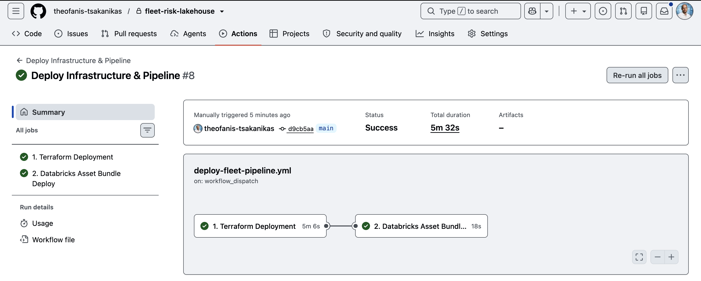

**3. 🛠️ The `terraform.sh` orchestrator** — automates secret injection (fetches SPN credentials from AWS Secrets Manager → `TF_VAR_*`), manages per-layer S3 backends, and provides `fmt`/`plan`/`apply`/`destroy` across all five layers. Isolated state files per layer minimise the blast radius of any change.

---

## 🚦 Operational Guide (Local Deployment & Lifecycle)

> The `Makefile` is the front door; the shell scripts below are what it calls (and what CI calls).

> 🔑 **Before the first run** there is a one-time bootstrap (Terraform does not create these itself): the Terraform **state S3 bucket**, an **Account-Admin Databricks SPN**, AWS credentials (admin keys locally / an OIDC role for CI), your real `TF_VAR_aws_account_id`, and the account-level `fleet_safety_officers` group. Alerting (Slack/PagerDuty) and Grafana are optional. The full checklist lives in **[CLAUDE.md → Prerequisites](./CLAUDE.md#prerequisites-one-time-bootstrap)**.

```bash
# 1. Bootstrap the local env (.venv + .env)
make setup

# 2. Deploy infrastructure (mandatory order)
make infra-up                 # 01_infra → 02_workspace → 03_unity_catalog

# 3. Deploy + run the pipeline
make deploy && make run       # 8-task mock Medallion job
BUNDLE_JOB_NAME=real_telemetry_job make run   # real VED replay

# 4. (optional) Grafana dashboards as code
make grafana-up               # 04_grafana → 05_grafana_content

# 5. Teardown (reverse order)
make grafana-down && make infra-down
```

> 🖱️ **Or run it from GitHub with one click:** the **Run Fleet Pipeline** workflow (`workflow_dispatch`) offers a dropdown to pick the scenario — *Simulated IoT sensors (mock data)* or *Real vehicle telemetry (VED replay)* — deploys the current bundle, and runs the matching job.

---

## 🚀 Future Roadmap & Scalability
The platform is designed for continuous evolution (see [docs/SCALING.md](./docs/SCALING.md)):
* **Delta Live Tables (DLT):** the declarative DQ expectations are SQL predicates precisely so they can be pushed into DLT `EXPECT` / Delta `CHECK` constraints at scale.
* **Continuous streaming:** if the freshness SLA tightens below the run interval, migrate the Gold join to a stateful stream-stream join with watermarks — the stateless SQL builders port directly ([ADR-004](./docs/adr/ADR-004-micro-batch-execution.md)).
* **Predictive safety:** Databricks Model Serving to predict driver fatigue from biometric aggregates.
* **Enhanced security:** fully private networking via AWS VPC PrivateLink.

## 🤝 Conclusion
A **modern data stack** built on **reliability, security, and observability** — Infrastructure as Code, data as a product, explainable analytics, and governance that is *enforced and checked in CI*, not just documented.
