<p align="center">
  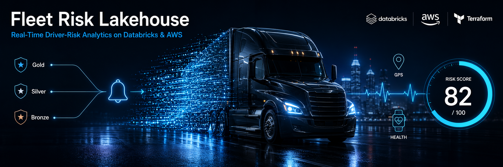
</p>

# Fleet Risk Lakehouse

<p align="center">
  <a href="https://github.com/theofanis-tsakanikas/fleet-risk-lakehouse/actions/workflows/ci.yml"></a>
  <a href="./LICENSE"></a>
  
  
  <br>
  
  
  
  
  <br>
  
  
  
  
</p>

**A lakehouse that correlates vehicle telemetry with driver biometrics into one explainable
risk score — then governs the sensitive half of that data with masks the platform enforces,
not policies it documents.**
*Databricks · Unity Catalog · Spark Structured Streaming · Delta Lake · AWS · Terraform · Grafana · Streamlit*

---

## The problem

A driver can pass every single check — legal speed, "normal" heart rate — and still be one moment
from an incident. Speed alone doesn't tell the story; biometrics alone don't either. **Together, they
do.** Fleet operators watch the two signals in separate systems, and the correlation that would
have flagged the driver is the one thing nobody is looking at.

The catch is that the second signal is **special-category data under GDPR Art. 9**. Heart rate and
stress cannot simply be joined into a warehouse and handed to whoever queries it. So this platform
does both halves: it joins the streams on a ±60-second window, produces a risk score that *shows
its work*, escalates the critical cases to Slack and PagerDuty — and makes the biometrics
invisible to every principal outside one privileged group, on **every** Gold surface, enforced by
Unity Catalog rather than by a policy document.

## Status

Everything below ran end to end on real AWS and Databricks infrastructure, provisioned from zero by
five Terraform layers and a Databricks Asset Bundle. The screenshots are from those runs. Two jobs
share the identical 8-task medallion DAG — one on simulated sensors, one replaying **real vehicle
telemetry** — and the platform is torn down between demos, so its resting state is "gone".

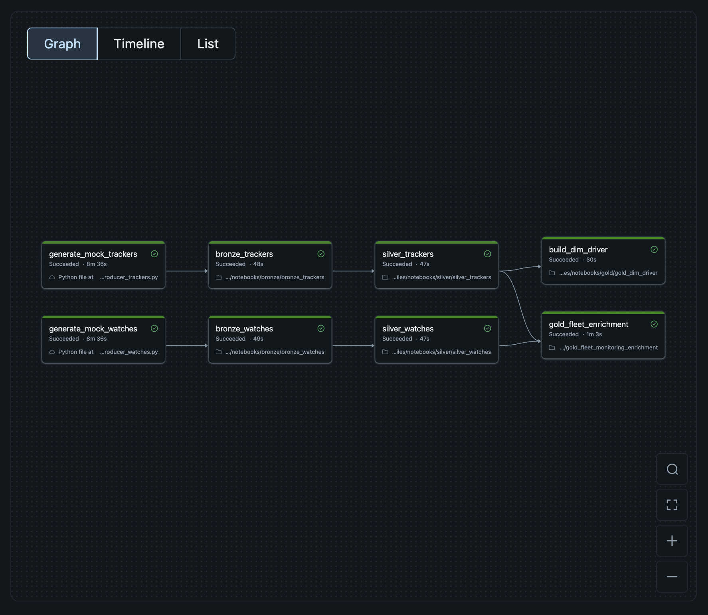

<sub><b>The 8-task DAG, green end to end</b> — two independent domain tracks (trackers and wearables) run Bronze and Silver in parallel and converge at Gold enrichment; <code>build_dim_driver</code> branches off Silver and runs alongside it. One click in GitHub Actions reproduces the whole thing.</sub>

> **A reference implementation, not a production deployment.** The scope and the trade-offs — a
> micro-batch recompute instead of continuous streaming, simulated biometrics, a manual metastore
> teardown — are deliberate and written down: in the [ADRs](./docs/adr/), and plainly in
> [What this does not do](#what-this-does-not-do).

---

## Contents

| | |
|---|---|
| **[Architecture](#architecture)** | Two source domains, one Gold catalog, and the lineage Unity Catalog traced by itself |
| **[The medallion journey](#the-medallion-journey)** | Auto Loader → cleansing that never fabricates → a ±60s temporal join |
| **[The risk score, explained](#the-risk-score-explained)** | Per-factor point contributions, not a black-box number |
| **[GDPR Art. 9, enforced](#gdpr-art-9-enforced)** | The same query, two principals, two different answers |
| **[Quality, drift and self-observability](#quality-drift-and-self-observability)** | Quarantine over silent drops, PSI drift, a pipeline that measures itself |
| **[Dashboards and alerting](#dashboards-and-alerting)** | Streamlit, Grafana as code, and push alerts that carry no biometrics |
| **[DevOps and Infrastructure as Code](#devops-and-infrastructure-as-code)** | Five layers, isolated state, keyless OIDC |
| **[Quickstart](#quickstart)** · **[Testing](#testing)** · **[Repository layout](#repository-layout)** | Run it, and what the 173 tests do and do not cover |
| **[What this does not do](#what-this-does-not-do)** · **[Cost](#cost)** · **[Decisions](#decisions)** | The honest limits, the bill, and the 10 records behind them |
| **[Docs](#docs)** · **[Security](#security)** · **[License](#license)** | |

---

## Architecture

Two source domains stay isolated in their own catalogs and meet only in **Gold**. Every layer runs
on Spark job compute; a serverless SQL Warehouse only *serves* the result to the dashboards, so
there is no always-on cluster anywhere in the design.

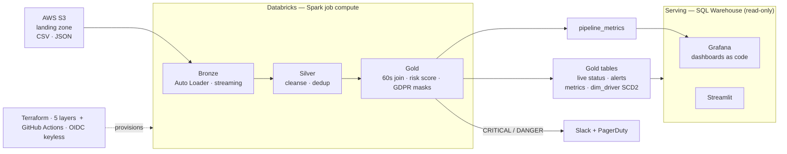
```mermaid
flowchart LR
    S3["AWS S3<br/>landing zone<br/>CSV · JSON"]
    subgraph DBX["Databricks — Spark job compute"]
        direction TB
        BR["Bronze<br/>Auto Loader · streaming"]
        SI["Silver<br/>cleanse · dedup"]
        GO["Gold<br/>60s join · risk score · GDPR masks"]
        BR --> SI --> GO
    end
    GO --> TB["Gold tables<br/>live status · alerts<br/>metrics · dim_driver SCD2"]
    GO --> PM["pipeline_metrics"]
    subgraph SRV["Serving — SQL Warehouse (read-only)"]
        GR["Grafana<br/>dashboards as code"]
        ST["Streamlit"]
    end
    S3 --> BR
    TB --> SRV
    PM --> GR
    GO -->|CRITICAL / DANGER| AL["Slack + PagerDuty"]
    IAC["Terraform · 5 layers  +  GitHub Actions · OIDC keyless"] -. provisions .-> DBX
```

The same flow, not drawn by hand — **column-level lineage Unity Catalog traced by following the
SQL**, from the raw volumes through to the Gold tables:

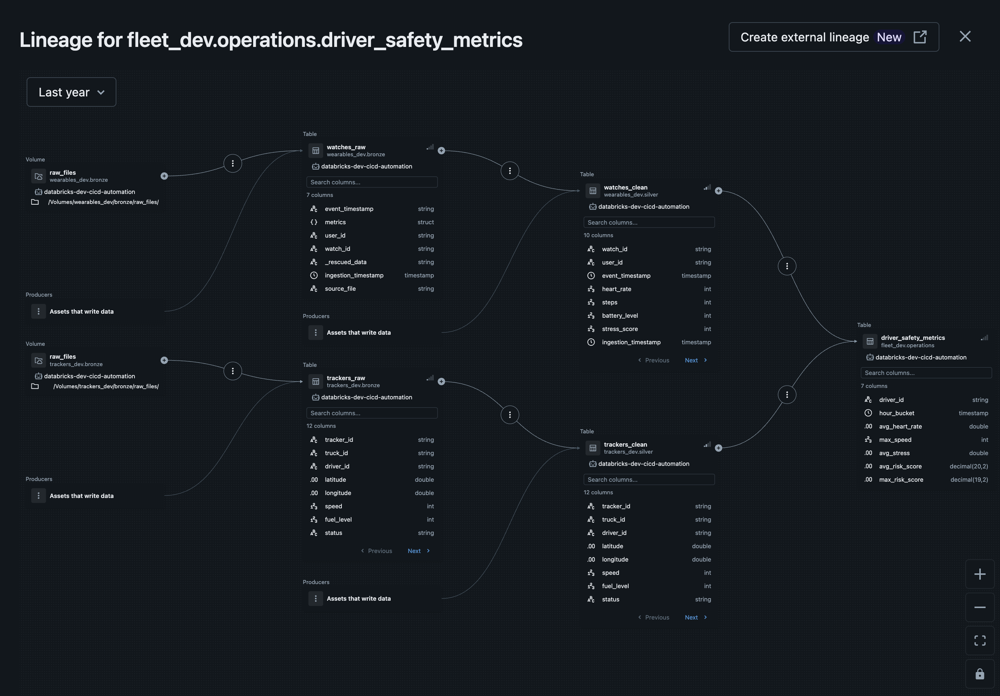

<sub><b>Lineage, captured not authored</b> — nobody drew this. Unity Catalog followed the transformations, which is also what makes the masking claim below verifiable rather than asserted.</sub>

The three domain catalogs and the three masking **functions** that enforce Art. 9 live in Unity
Catalog itself:

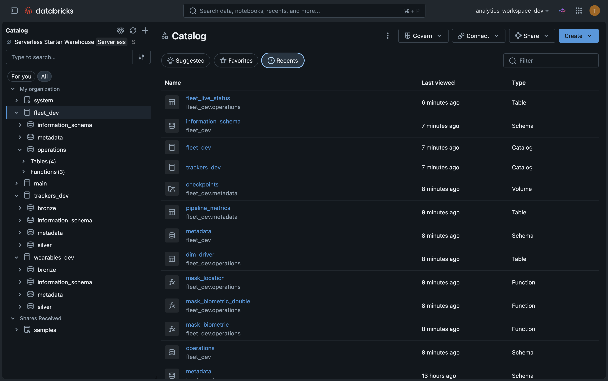

<sub><b>Governance as objects, not documents</b> — <code>mask_biometric</code>, <code>mask_biometric_double</code> and <code>mask_location</code> are Unity Catalog functions, bound to columns. Two policies, three functions: a mask's parameter type must match the column exactly, so the <code>DOUBLE</code> aggregates need their own variant. There is no application layer that can be bypassed by querying the table directly.</sub>

**The stack, in one list:** AWS (S3, Secrets Manager, IAM, Amazon Managed Grafana) · Databricks
Unity Catalog for governance and fine-grained access control · Apache Spark Structured Streaming
with pure, unit-tested transform logic under `src/` · Databricks Asset Bundles orchestrating two
8-task Workflow DAGs · Terraform + GitHub Actions with keyless OIDC · Amazon Managed Grafana and a
Streamlit command center over a serverless SQL Warehouse.

---

## The medallion journey

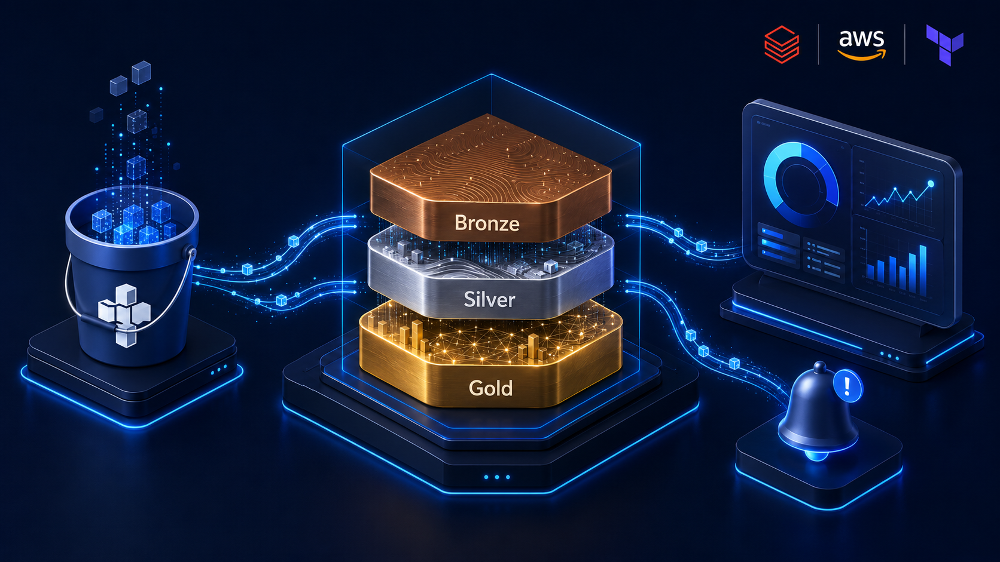

<sub><b>The shape of the pipeline</b> — two domains in, one governed Gold layer out, with quality, masking, drift and alerting wrapped around the enrichment stage.</sub>

### The sources — simulation *and* the real world

The mock engine injects deliberate defects (null heart rates, sentinel speeds, malformed IDs, ~20%
duplicates) *and* genuine extreme-heart-rate incidents, so the DANGER and CRITICAL paths actually
fire rather than being demonstrated on paper. Alongside it, `real_telemetry_job` streams genuine
trips from the [Vehicle Energy Dataset](data/ved/README.md) — real GPS traces, real speeds, real
hard-braking events — through the *identical* medallion contract, with biometrics simulated
**conditioned on those real driving events** ([ADR-008](./docs/adr/ADR-008-real-data-replay.md)).

<table>
<tr>
<td width="50%">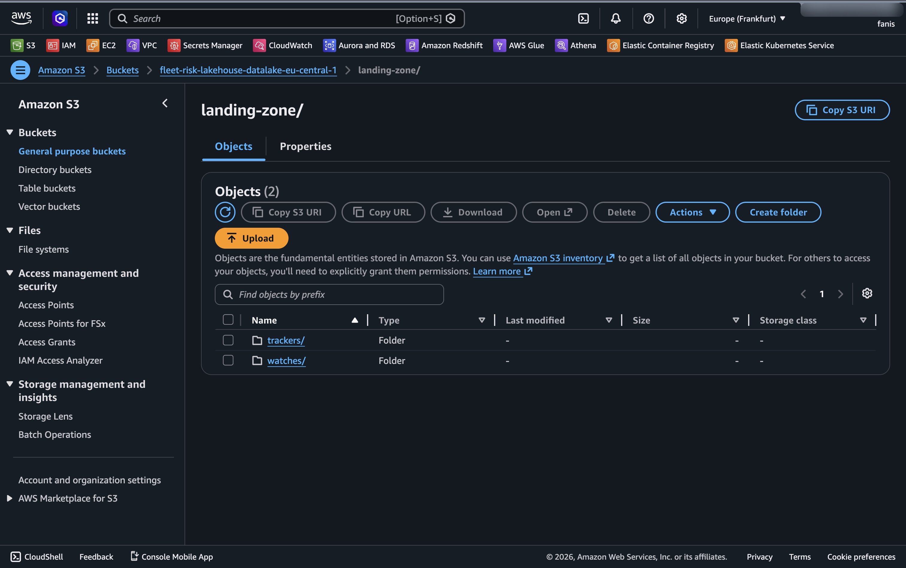<br><sub><b>The landing zone</b> — raw CSV and JSON batches arriving in an S3 external volume, where Auto Loader picks them up. One prefix per domain.</sub></td>
<td width="50%">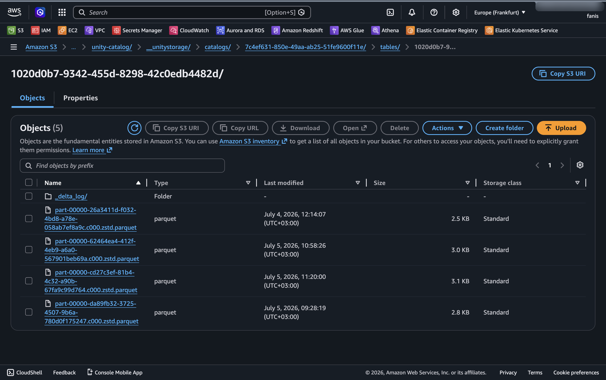<br><sub><b>What they become</b> — a UUID-keyed folder per managed table (Unity Catalog decouples the name from the path), a <code>_delta_log/</code> giving ACID and time travel, and ZSTD-compressed Parquet.</sub></td>
</tr>
</table>

### Bronze — ingestion that loses nothing

Databricks **Auto Loader** (`cloudFiles`, Structured Streaming) with schema evolution and a
**rescued-data** column, so a malformed record is quarantined into `_rescued_data` rather than
dropped, plus managed checkpointing in an isolated Volume — exactly-once-style, with no
reprocessing after a restart:

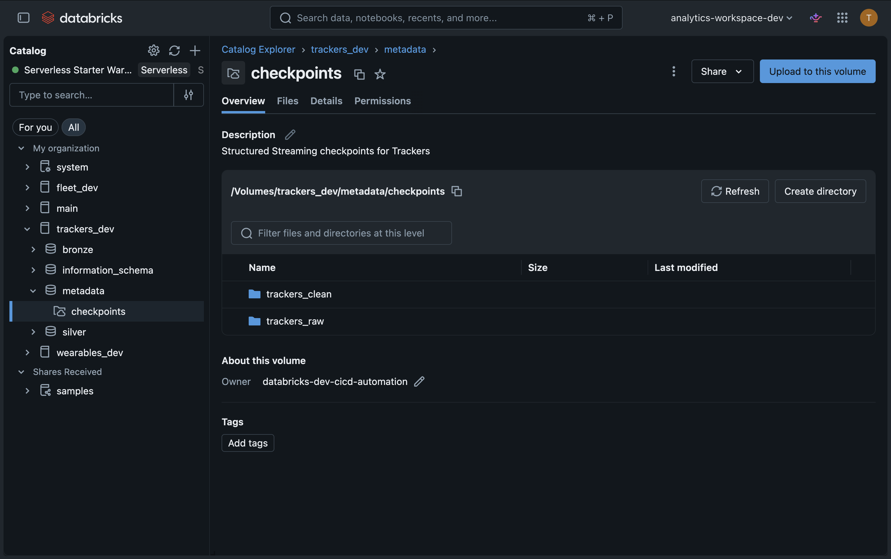

<sub><b>Checkpoints in their own Volume</b> — the reason a restart resumes instead of replaying. Isolated from the data volumes so a data cleanup cannot corrupt streaming state.</sub>

### Silver — clean, don't destroy

Type casting, deduplication on each stream's device key (`(tracker_id, event_timestamp)` /
`(watch_id, event_timestamp)`), and one rule that decides the
character of the whole layer: **drop a row only when it is unrecoverable** (ghost driver `DRV_999`,
malformed IDs) — otherwise *null the individual bad reading* (GPS `(0,0)`, speed `-1`/`999`, heart
rate `-999`/`0`/`>220`) and keep the row. **Never fabricate a value.**

<table>
<tr>
<td width="50%">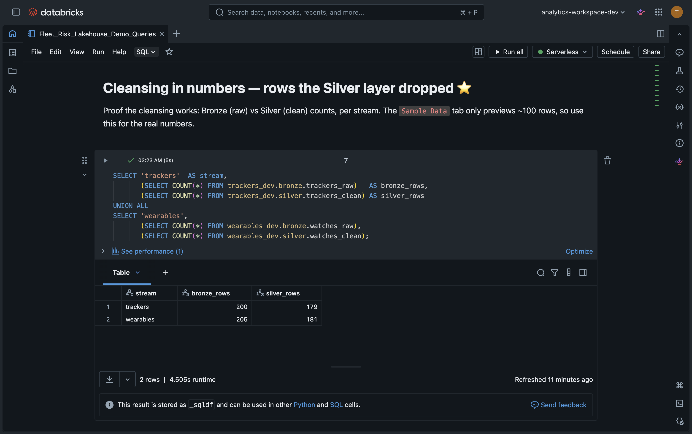<br><sub><b>Cleansing, measured</b> — Bronze against Silver row counts. The drop is a number you can point at, not an assurance that "bad data is handled".</sub></td>
<td width="50%">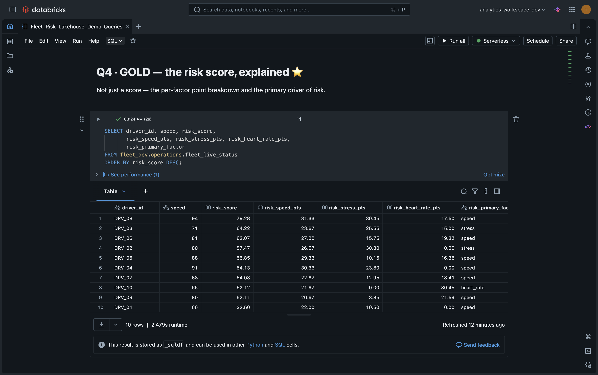<br><sub><b>What comes out of Gold</b> — <code>fleet_live_status</code> with the risk score beside the per-factor points that produced it.</sub></td>
</tr>
</table>

### The join

Asynchronous stream correlation via a **±60-second temporal join**
([ADR-002](./docs/adr/ADR-002-temporal-join-window.md)): a watch event matches any tracker event
within a minute either side. Where that produces several matches for one driver,
`fleet_live_status` resolves to the most recent with a window function, while
`fleet_safety_alerts` deliberately keeps them all — an alert table that de-duplicates away a second
incident is worse than none.

---

## The risk score, explained

A single source of truth in code (`src/fleet_transforms/risk_model.py`) builds the SQL, and the
generated [risk model card](docs/governance/RISK_MODEL_CARD.md) reads from the same object — so the
documentation cannot drift from the formula, and CI's `--check` enforces it.

What matters is what the Gold view emits alongside the number: `risk_speed_pts`,
`risk_stress_pts`, `risk_heart_rate_pts` and `risk_primary_factor`. A high-risk driver is
**explained**, not merely flagged — the operator sees *which* signal drove the score, which is the
difference between an alert someone acts on and one they learn to dismiss.

Every qualifying event is then classified into `CRITICAL` / `DANGER` / `WARNING` / `OVERSPEED` in
`fleet_safety_alerts`, the table that feeds Slack and PagerDuty:

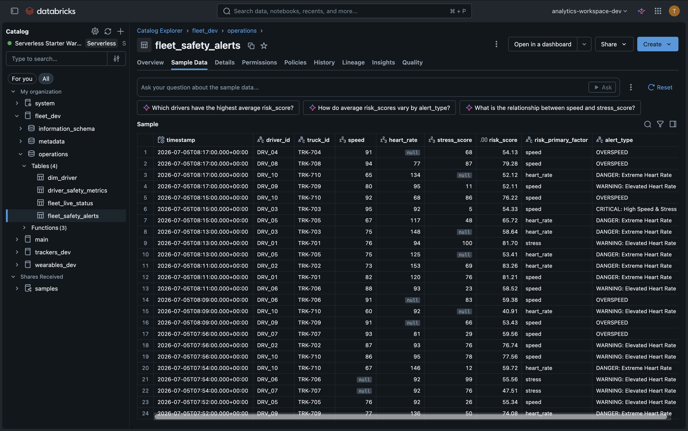

<sub><b>The alert table</b> — severity-classified events with the risk score and its drivers attached, so the notification downstream carries a reason rather than a number.</sub>

---

## GDPR Art. 9, enforced

Heart rate and stress are classified as **special-category data** in code
(`src/fleet_governance/classification.py`), and a CI test fails if any Gold column is left
unclassified — you cannot add a column and forget to decide what it is.

The enforcement is a Unity Catalog **column mask** whose predicate is a single group membership
check, `is_account_group_member('fleet_safety_officers')`. So the **same query returns different
data depending on who runs it**:

<table>
<tr>
<td width="50%">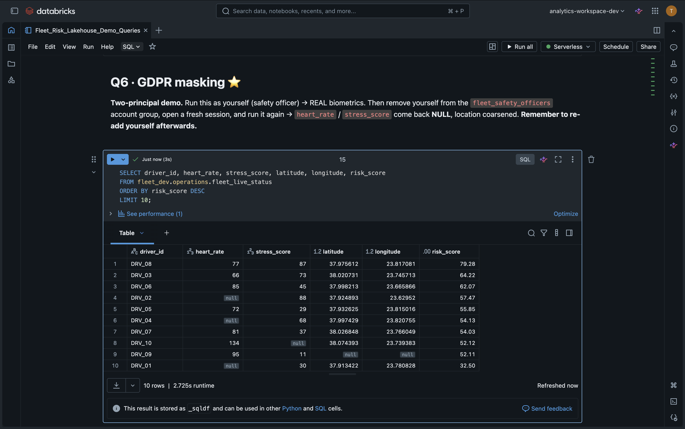<br><sub><b>As a <code>fleet_safety_officers</code> member</b> — real biometrics, precise location. The privileged path.</sub></td>
<td width="50%">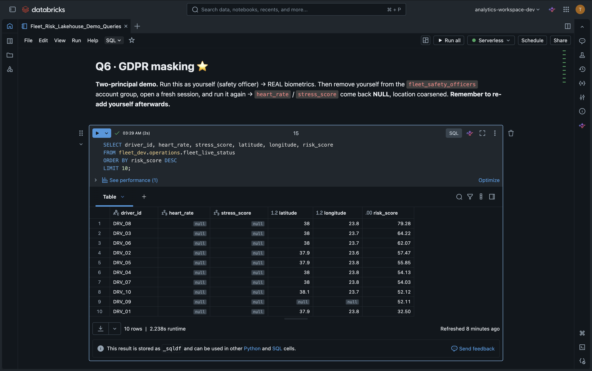<br><sub><b>As an analyst outside the group</b> — biometrics come back <code>NULL</code>, location coarsened to one decimal. Same query, same table, same instant.</sub></td>
</tr>
</table>

Nothing in the data changed — only the principal did. That is the whole point: the mask is applied
by the platform on **all four** Gold surfaces (live, alerts, quarantine, aggregates — because
aggregation does not de-identify), so there is no query path that returns the raw values to an
unprivileged caller, and no application layer to bypass ([ADR-007](./docs/adr/ADR-007-column-masking.md)).

The read-only BI service principal behind Grafana is deliberately **not** in that group, which is
why the dashboards below show risk and coarse location but never a heart rate.

---

## Quality, drift and self-observability

The Gold stage wraps the enrichment with four cross-cutting concerns, each a pure, unit-tested
module under `src/` — the notebook only orchestrates.

- **Declarative data quality with quarantine.** Named SQL expectations carry an `ERROR` or `WARN`
  severity; rows violating an `ERROR` expectation are *quarantined* into
  `fleet_live_status_quarantine` annotated with `_dq_failures`, **not silently dropped**
  ([ADR-005](./docs/adr/ADR-005-declarative-data-quality.md)). A run that writes fewer rows than
  expected has a table you can query for the reason.
- **Dimensional history (SCD Type 2).** `dim_driver` versions each driver→truck assignment over
  time via a Delta `MERGE` ([ADR-006](./docs/adr/ADR-006-scd2-driver-dimension.md)), so "who was
  driving that truck in March" is answerable.
- **Drift.** The risk-score distribution is compared to a baseline with PSI. Drift is a **WARN
  signal, not a failure** — a significant PSI usually means a sensor cohort was recalibrated, not
  that the fleet got riskier, and failing the run would teach everyone to ignore it.
- **Self-metrics.** A tall, append-only `pipeline_metrics` fact — row counts, `join_match_rate`,
  quarantine count, `risk_score_psi`, band distribution — one row per `(run_id, stage, metric)`,
  trended in Grafana.

---

## Dashboards and alerting

### Streamlit — the command center

A self-contained **Fleet Safety Command Center** reads Gold directly over the serverless SQL
Warehouse, or falls back to a bundled offline dataset when no workspace is configured — one toggle
in the sidebar, no code change.

<table>
<tr>
<td width="50%">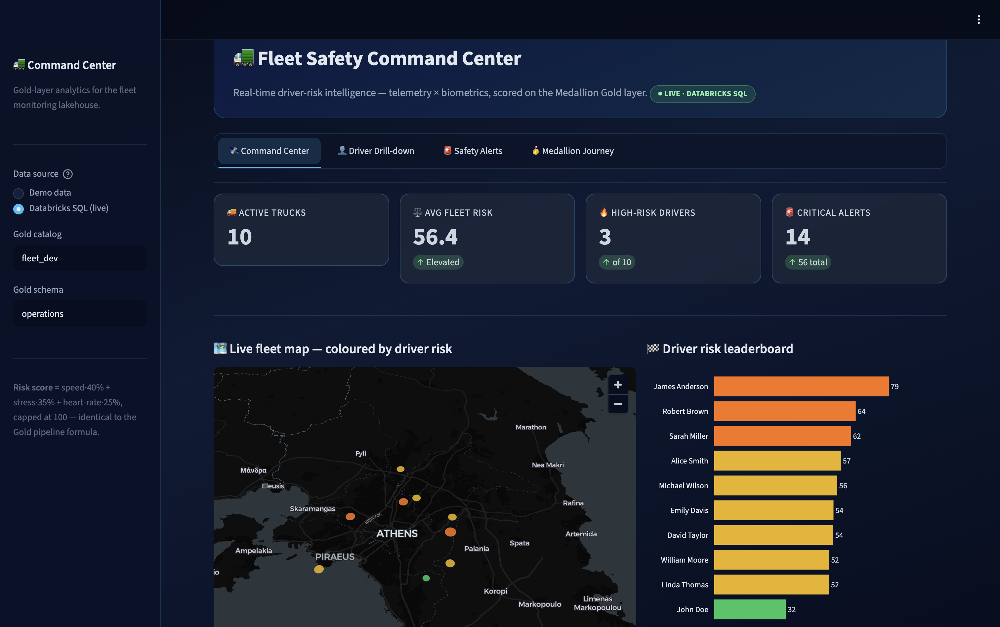<br><sub><b>Live on Databricks SQL</b> — the header badge flips to <b>● LIVE · DATABRICKS SQL</b>, and the KPIs, the risk-coloured fleet map and the driver leaderboard all read the real Gold tables.</sub></td>
<td width="50%">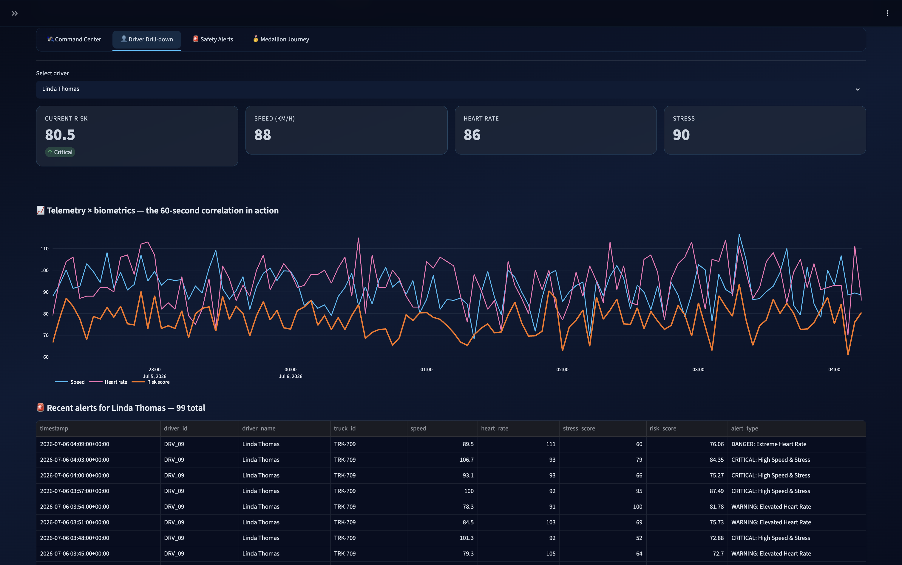<br><sub><b>The thesis, visible</b> — speed, heart rate and the resulting risk on one shared timeline, built from the ±60-second temporal join. Either signal alone would miss the moment the correlation catches.</sub></td>
</tr>
</table>

### Grafana — dashboards as code

Amazon Managed Grafana, with its datasource **and** dashboards provisioned entirely in Terraform
([ADR-010](./docs/adr/ADR-010-grafana-infinity-datasource.md)). The official Databricks plugin is
Enterprise-only (+$45/active user/mo on AMG), so the dashboards query through the free OSS
**Infinity** datasource against the Databricks SQL Statement Execution API, authenticated as the
read-only BI service principal — which means they respect the column masks *by construction*
rather than by configuration.

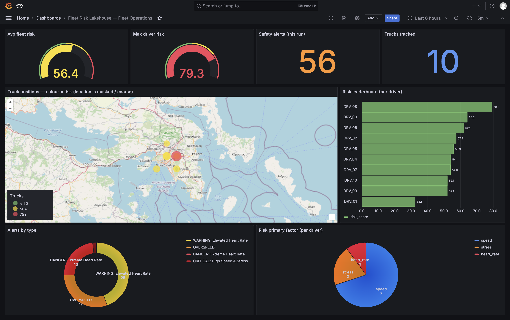

<sub><b>Fleet Operations</b> — risk gauges, a geomap coloured by risk (coarse location, because the querying principal is masked), a per-driver leaderboard, and severity-coloured alert and factor breakdowns. Provisioned by <code>terraform apply</code>; no dashboard was clicked together.</sub>

### Push alerting — from the pipeline, not from a poller

Critical events are pushed **from the Gold run itself**, severity-routed and deduplicated per
driver and severity ([ADR-009](./docs/adr/ADR-009-alert-notifications.md)) — event-driven rather
than waiting for Grafana to notice on its next poll.

<table>
<tr>
<td width="50%">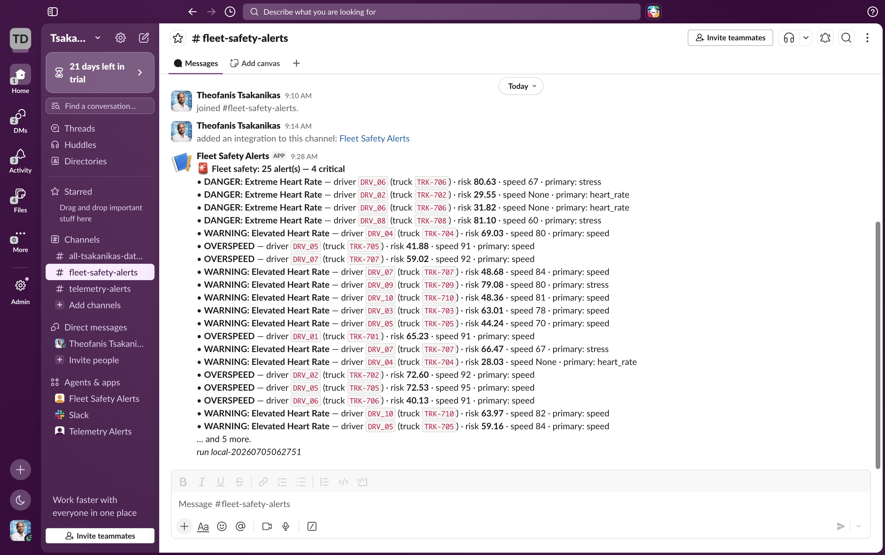<br><sub><b>Slack</b> — a batched, team-awareness message. The payload is projected onto an allowlist of operational fields, and a test asserts it: <b>no Art. 9 biometric ever leaves the platform</b>.</sub></td>
<td width="50%">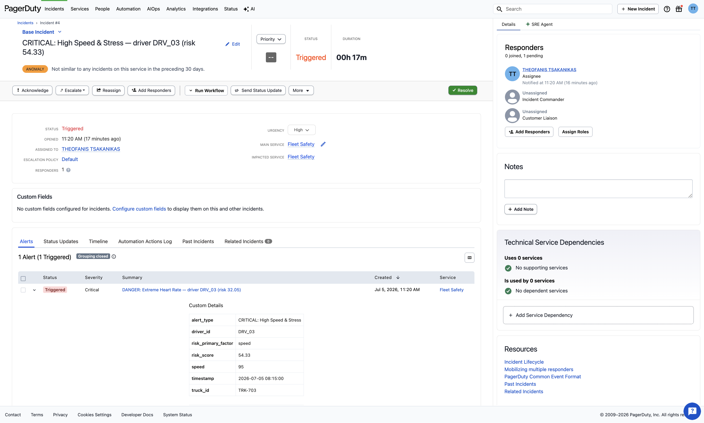<br><sub><b>PagerDuty</b> — the on-call escalation for <code>CRITICAL</code> and <code>DANGER</code>. The custom details carry alert type, driver, risk score and speed — and never the raw heart rate that caused them.</sub></td>
</tr>
</table>

The allowlist is the design choice worth noticing: an outbound payload built by *removing* the
sensitive fields would leak the first time someone adds a column. Built by *listing* the permitted
ones, it cannot.

---

## DevOps and Infrastructure as Code

Five isolated Terraform layers with per-layer remote state, so a failed destroy of layer 03 cannot
corrupt layer 01 and concurrent plans on different layers never contend
([ADR-001](./docs/adr/ADR-001-terraform-layered-state.md)). `terraform.sh` orchestrates them and
handles the one genuinely awkward part — fetching the project SPN credentials out of AWS Secrets
Manager and injecting them as `TF_VAR_*` for layers 02 and 03, so they are never typed by hand.

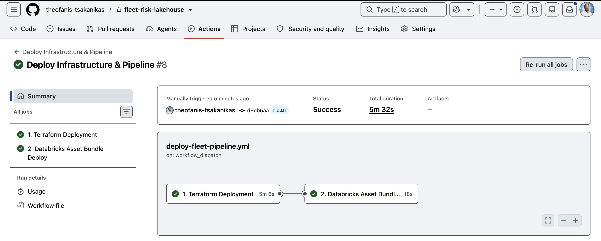

<sub><b>Keyless, and manual on purpose</b> — GitHub Actions authenticates to AWS via <b>OIDC</b>; no long-lived cloud key is stored in the repository. The deploy is <code>workflow_dispatch</code>-only, so a merge to <code>main</code> cannot provision infrastructure.</sub>

A [`Makefile`](./Makefile) is the front door (`make help`) and defines the CI gates in exactly one
place — `make check` runs locally what CI runs remotely, and the workflow calls the same targets, so
the two cannot drift.

---

## Quickstart

> **One-time bootstrap first.** Terraform does not create these: the state S3 bucket, an
> Account-Admin Databricks SPN, AWS credentials, your real `TF_VAR_aws_account_id`, and the
> account-level `fleet_safety_officers` group. Alerting and Grafana are optional and feature-gated.
> Full checklist in [CLAUDE.md → Prerequisites](./CLAUDE.md#prerequisites-one-time-bootstrap).

```bash
# 1. Bootstrap the local env (.venv + .env)
make setup

# 2. Deploy infrastructure — the order is mandatory
make infra-up                 # 01_infra → 02_workspace → 03_unity_catalog

# 3. Deploy and run the pipeline
make deploy && make run       # the 8-task mock medallion job
BUNDLE_JOB_NAME=real_telemetry_job make run   # the real VED replay

# 4. (optional) Grafana dashboards as code
make grafana-up               # 04_grafana → 05_grafana_content

# 5. Teardown, in reverse
make grafana-down && make infra-down
```

**Or run it from GitHub with one click:** the **Run Fleet Pipeline** workflow offers a dropdown —
*Simulated IoT sensors* or *Real vehicle telemetry (VED replay)* — deploys the current bundle and
runs the matching job.

---

## Testing

**173 tests**, infrastructure-free: pure-Python and local PySpark, no cloud account, no credentials,
no running workspace. They cover the risk model and its explanation, the Silver cleansing rules, the
Gold SQL builders, the declarative quality framework, SCD2, PSI drift, the alert payloads, the
masking derivation, the governance classification, and the replay path.

```bash
make check    # everything CI runs: lint + fmt-check + test + govern-check
make test | lint | fmt | govern-docs
```

Three of them are guards rather than unit tests, and they are the ones worth knowing about:

- **No Gold column may be unclassified.** Add a column without deciding whether it is
  special-category data and the suite fails.
- **The generated governance docs must match the code.** `govern-check` regenerates the risk model
  card and the GDPR Art. 30 record and fails on any diff, so a changed weight cannot ship with stale
  documentation.
- **The storage baseline must hold.** Each S3 bucket must declare its public-access block,
  encryption *and* versioning; a versioned bucket must expire non-current versions; the Secrets
  Manager recovery window must stay environment-gated. Each of these was verified by breaking it on
  purpose and confirming the test refuses.

`terraform fmt -check` and `terraform validate` run per layer in the same suite, offline.

**What the tests do not cover:** anything that needs a live workspace. The masks are unit-tested as
*derivations* — that the right columns get the right mask function — but the proof that Unity
Catalog enforces them is the screenshot above, from a real run, not an assertion in CI.

---

## Repository layout

| Path | Purpose |
|---|---|
| [`notebooks/`](notebooks/) | Thin Databricks job tasks — Bronze ingestion, Silver cleansing, Gold enrichment, SCD2 dimension. Orchestration only; the logic lives in `src/` |
| [`src/fleet_transforms/`](src/fleet_transforms/) | Pure transforms: silver rules, Gold SQL builders, **`risk_model.py`** (single source of truth), quality, observability, dimensions, drift |
| [`src/fleet_governance/`](src/fleet_governance/) | GDPR Art. 9 classification, the Unity Catalog masks derived from it, and the generator for `docs/governance/` |
| [`src/fleet_alerting/`](src/fleet_alerting/) | Severity routing and Slack/PagerDuty payloads built from an allowlist — no Art. 9 field can be added by accident |
| [`src/mock_generator/`](src/mock_generator/) · [`src/replay/`](src/replay/) | The IoT simulation engine, and the real-VED replay that feeds the same contract |
| [`app/`](app/) | Streamlit "Fleet Safety Command Center" — offline demo or live Databricks SQL |
| [`data/ved/`](data/ved/) | Committed real VED sample (10 vehicles, 18 trips) with attribution |
| [`terraform/`](terraform/) | `01_infra` · `02_workspace` · `03_unity_catalog` · `04_grafana` · `05_grafana_content` + reusable `modules/` |
| [`docs/adr/`](docs/adr/) | 10 decision records |
| [`docs/governance/`](docs/governance/) | **Generated** risk model card + GDPR Art. 30 processing record (CI `--check`) |
| [`tests/`](tests/) | 173 tests — pure-Python + local PySpark, infrastructure-free |
| `databricks.yml` · `Makefile` · `terraform.sh` / `bundle.sh` / `setup.sh` | The bundle, the front door, and the three scripts CI also calls |

---

## What this does not do

- **Gold is a micro-batch recompute, not a continuous stream.** Bronze and Silver are Structured
  Streaming; the Gold join runs per invocation. If the freshness SLA tightened below the run
  interval, the stateless SQL builders port directly to a stateful stream-stream join with
  watermarks — that is why they are written as builders
  ([ADR-004](./docs/adr/ADR-004-micro-batch-execution.md)). Nothing here proves that migration.
- **The biometrics are simulated — always.** Even in the real-data replay, only the *telemetry* is
  genuine: the heart rate and stress are generated conditioned on real hard-braking and overspeed
  events. No real physiological data was used, and the risk model has never been validated against
  a real safety outcome.
- **`prod` has never been applied.** `databricks.yml` defines a `prod` target and the Terraform is
  environment-parameterised, but every run has been `dev`. The architecture supports promotion;
  nobody has performed it.
- **The deployer role's trust policy is not in this repository.** The GitHub OIDC provider and the
  IAM role are a manual one-time prerequisite, referenced by the `AWS_DEPLOY_ROLE_ARN` secret. So
  nothing here declares or verifies which branches and environments may assume it — see
  [SECURITY.md](SECURITY.md).
- **Teardown stops at the metastore, on purpose.** The Databricks API will not delete a metastore
  from CI even with `force_destroy`, so the destroy is a documented **two-pass** operation with a
  manual step in the middle. It is a known limitation, not a bug, and the order matters — inverting
  it leaves dirty state in two more layers.
- **The Grafana service-account token is 30 days.** Layer 05 authenticates with a token layer 04
  emits; rotating it means re-applying 04 and then 05. There is no automatic rotation.
- **The Streamlit app has no authentication.** It is a demo surface. Anyone who can reach the port
  can read whatever the configured principal can read — which is why the principal it uses matters.
- **Drift is detected, never acted upon.** A high `risk_score_psi` writes a metric and colours a
  panel. No run fails, no model retrains, nobody is paged.

---

## Cost

**Nothing is standing today.** The platform is deployed on demand and torn down. What follows is what
it would cost *while it stands* — list prices for `eu-central-1`, **verified 2026-08-12**.

| Resource | Spec | Rate | Monthly |
|---|---|---|---:|
| Databricks SQL warehouse | serverless PRO **2X-Small** (4 DBU/hr), auto-stop 10 min, ~20 hr/mo | **$0.91/DBU (EU)** | **$72.80** |
| Databricks jobs | serverless, 2 jobs × 8 tasks, ~20 runs/mo × ~5 min | **$0.91/DBU (EU)** | ~$32.50 |
| Amazon Managed Grafana | 1 workspace, 1 active editor | $9/editor-mo | $9.00 |
| S3 — data lake | landing zone + managed Delta, versioned, non-current expiry 30 d | $0.023/GB-mo | ~$0.50 |
| S3 — metastore root | Unity Catalog managed tables | $0.023/GB-mo | ~$0.25 |
| Secrets Manager | 1 secret | $0.40/secret-mo | $0.40 |
| Metastore, workspace, UC objects, IAM | control plane only | free | $0.00 |
| **Total** | | | **≈ $115 / month** |

**The auto-stop is the entire cost control, and the arithmetic shows why.** The warehouse draws
4 DBU/hr × $0.91 = **$3.64/hour**. At ~20 hours of genuine query time a month it costs $72.80; left
running 10 hours a day on business days it would cost **~$800** (and ~$1,090 if left up every day). The 20–30 second cold start on the first Grafana query
after an idle period is what that saving is bought with.

There is no always-on compute anywhere else by design: Spark job compute is serverless and released
the moment a run finishes, which is the real argument for the micro-batch decision
([ADR-004](./docs/adr/ADR-004-micro-batch-execution.md)) rather than just its simplicity.

**Levers:** `make grafana-down` removes the $9 — the only charge that bills per user regardless of
use, and the reason layers 04/05 are standalone and feature-gated. `make infra-down` returns the rest
to zero, with the documented two-pass metastore caveat.

*Databricks serverless SQL lists at $0.70/DBU in US regions and **$0.91/DBU in the EU**; this estate is
`eu-central-1`, so the EU rate applies. Rates verified 2026-08-12; verify before quoting.*

---

## Decisions

Ten records in [`docs/adr/`](docs/adr/) — what was chosen and, more usefully, what was rejected.

| | |
|---|---|
| [ADR-001](./docs/adr/ADR-001-terraform-layered-state.md) | Five Terraform layers with isolated state, over one monolithic state file |
| [ADR-002](./docs/adr/ADR-002-temporal-join-window.md) | A ±60-second temporal join to correlate two independent, asynchronous streams |
| [ADR-003](./docs/adr/ADR-003-sql-warehouse-grafana.md) | A serverless SQL Warehouse as the BI query backend, over an always-on all-purpose cluster |
| [ADR-004](./docs/adr/ADR-004-micro-batch-execution.md) | Micro-batch recompute over continuous streaming — and exactly what would change if that flipped |
| [ADR-005](./docs/adr/ADR-005-declarative-data-quality.md) | A tiny declarative expectation framework with quarantine, over Great Expectations or a crash-on-bad-row |
| [ADR-006](./docs/adr/ADR-006-scd2-driver-dimension.md) | An SCD Type 2 driver dimension, so a reassignment cannot erase who was driving what, when |
| [ADR-007](./docs/adr/ADR-007-column-masking.md) | Unity Catalog column masks on all four Gold surfaces, because aggregation does not de-identify |
| [ADR-008](./docs/adr/ADR-008-real-data-replay.md) | Real vehicle telemetry replayed through the identical contract, with biometrics conditioned on real events |
| [ADR-009](./docs/adr/ADR-009-alert-notifications.md) | Alerts pushed from the pipeline on an allowlist, over Grafana polling |
| [ADR-010](./docs/adr/ADR-010-grafana-infinity-datasource.md) | The free OSS Infinity datasource over the Enterprise Databricks plugin |

---

## Docs

[architecture](docs/architecture.md) · [RUNBOOK](docs/RUNBOOK.md) — ops, incidents, recovery ·
[SCALING](docs/SCALING.md) — what changes from 10 to 10,000 drivers ·
[TESTING](docs/TESTING.md) — philosophy and coverage map ·
[governance](docs/governance/) — generated risk model card + GDPR Art. 30 record ·
[CHANGELOG](CHANGELOG.md)

The engineering reference — environment variables, layer apply order, and the gotchas that bite —
is in [`CLAUDE.md`](./CLAUDE.md).

## Security

What is hardened, the known limitations, and what a real deployment would do instead:
[SECURITY.md](SECURITY.md). The short version — keyless OIDC with no long-lived cloud key in CI,
gitleaks over the full history, per-layer isolated state, both S3 buckets versioned and encrypted
with public access blocked, a read-only BI principal that is deliberately not privileged, and
outbound alerts built from an allowlist so special-category data cannot leave by accident.

## License

[MIT](./LICENSE) © 2026 Theofanis Tsakanikas
