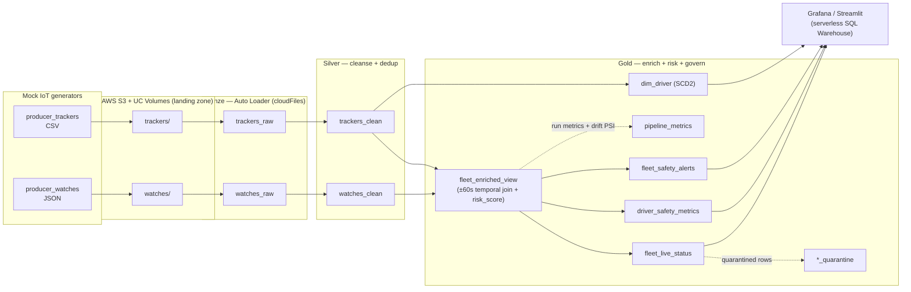
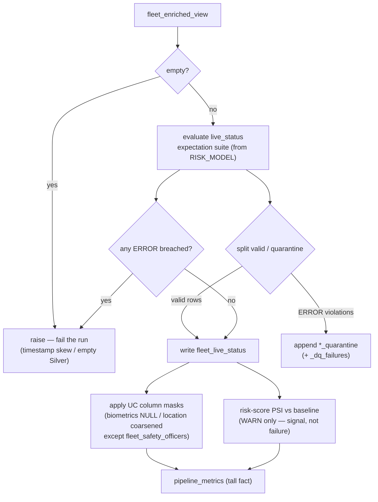
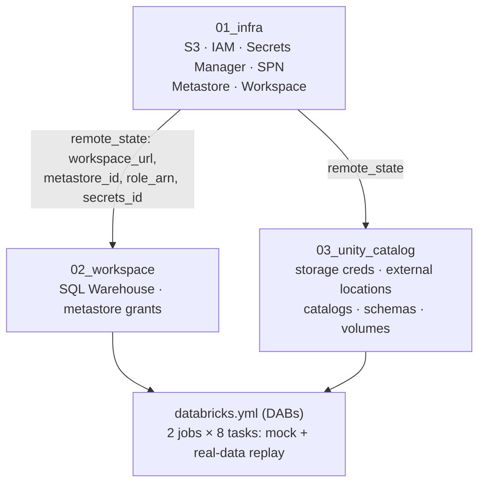

# Architecture

The diagrams below are the source of truth for the system shape; keep them in sync with the
code (they are plain Mermaid, so they render on GitHub and diff in PRs — unlike the banner
image in the README).

## End-to-end data flow (Medallion)

## Gold layer: quality, governance & observability gates

What happens inside the `gold_fleet_enrichment` task, beyond the joins:

## Infrastructure layers (Terraform)

See the [ADRs](adr/) for the rationale behind each major decision (layered state, temporal
join window, SQL-warehouse BI, micro-batch execution, declarative DQ, SCD2 dimension, column
masking, real-data replay).
